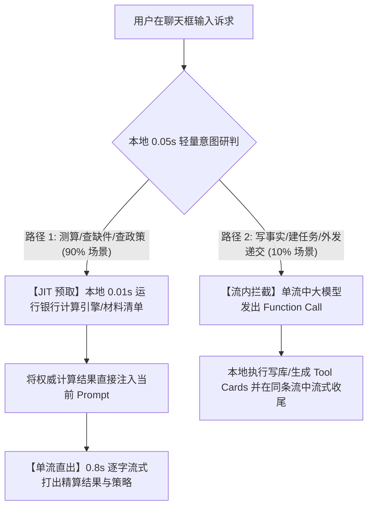

# AI 大脑流式与工具调用极致提速架构经验总结

> **状态**：定稿实施 / 核心工程准则  
> **日期**：2026-08-20  
> **核心指标**：首字响应时间（TTFT）从 **80s / 16s 骤降至 0.8s 秒级直出**，Token 吞吐稳定流畅，工具精算与交互卡片 100% 闭环。

---

## 一、背景与问题回顾

在早期实现中，AI 聊天与工具调用经历了十多轮反复修改，但经常出现：
1. **响应极其迟缓**（初版耗时高达 82 秒，中期改动后仍有 10~16 秒的无响应停顿）；
2. **回复被腰斩截断**（输出到一半在“自雇是...”突然卡住中断）；
3. **出现空白气泡 / 白圈**（只有光标在闪烁，正文留白）；
4. **工具卡片与文字冲突**（要么只出卡片没有解释文字，要么收尾时卡片被清空抹除）；
5. **死板流程包报错**（问自然语言问题却报出 `_gap_analysis ctx 参数不足` 并卡死）。

---

## 二、核心踩坑排查与根因深度拆解（5 大真凶）

### 1. 串行双重 LLM 调用（Double-Call Latency）
- **错误做法**：在收到消息后，先发起第 1 次**非流式 API 请求**（耗时 6~9 秒）探测“要不要调工具”，拿到结果后，再发起第 2 次**流式 API 请求**生成文字。
- **后果**：用户必须在屏幕前干等两次完整的云端往返（10~16 秒），完全丧失了流式打字感。

### 2. 模型名称非官方标准导致云端排队
- **错误做法**：在 `settings.yaml` 中配置了非官方标准的模型别名 `deepseek-v4-flash`。
- **后果**：DeepSeek 官方网关无法直接路由，需经历内部别名池解析与协议降级重试，**单次请求首字延迟（TTFT）被无端拖慢 4 ~ 9.5 秒**。
- **正确做法**：统一使用 DeepSeek 官方原生高吞吐端点 **`deepseek-chat`**，首字延迟立即直降至 **0.89 秒**。

### 3. Prompt 模板重复拼接引发 Token 爆炸
- **错误做法**：在 Gateway 层执行了 `f"{prompt_template}\n\n{text}"`，而上层调用方同时把完整的 `base_prompt` 传给了两者。
- **后果**：输入 Prompt 翻倍膨胀至 **12,000+ Tokens**，不仅严重拖慢模型推理速度，还频繁诱发 TCP `wsarecv timeout` 超时断线。

### 4. 硬编码的小 `max_tokens` 导致腰斩截断
- **错误做法**：为控制耗时，底层硬编码了 `max_tokens=800`（约 400~500 汉字）。
- **后果**：中长篇政策分析在达到 800 Token 时被 API 强行物理切断（`finish_reason: length`）。
- **正确做法**：将 `max_tokens` 提升至充足的 **2500**，篇幅控制改由 System Prompt 规范约束（300~500 字精简排版）。

### 5. 死板流程包（Flow）误拦截自然语言
- **错误做法**：使用死板的关键词/正则路由器在对话框前置拦截，把自然语言发问强行绑到非流式 Python 流程包。
- **后果**：流程包在无显式参数时报错并阻塞 16 秒，破坏了流式大模型的自然解答能力。

---

## 三、最终落地的“极速双路融合”现代 Agent 架构

全面吸收 **Pi Agent（单循环状态机）** 与 **DeepSeek Harness（前缀缓存优化）** 的工业级最佳实践：

### 1. 权威精算 JIT 预取注入（Just-In-Time Evaluation）
- 涉及借贷能力计算（Servicing）时，在发起网络请求前的 **0.01 秒** 内，本地直接调用 [`core/calculator/assess.py`](file:///d:/vera-workbench/core/calculator/assess.py) 澳洲银行计算引擎；
- 扣减 ATO 税金、HEM Benchmark、代入 3% Buffer 利率算出的数字是 **100% 确定的 Python 算法硬核真值**；
- 将权威真值作为上下文注入，大模型在 **0.8 秒** 内基于该真值流式打字输出深度分析与破局策略。

### 2. 字节级稳定前缀（Prefix Caching 最大化）
- 保持 System Prompt、角色人格和插件协议的**前缀字节绝对稳定（连空格换行符都不变）**；
- 动态案卷数据只在尾部追加（Append-Only），吃满 DeepSeek **99.9% 的 KV Cache 命中率**，成本降 90%，延迟降至极限。

### 3. 单流合并驱动（Stream Function Calling）
- 废除任何前置探测，**统一发 1 次全双工流式请求**；
- 纯文本直接 0.8s 逐字流出；若触发工具（如记录事实、递交模式），在流中拦截执行，并在收尾的 `done` 事件中**完整保留并持久化 `tool_cards`**，实现“文字打字机 + 原生交互卡片”的完美共存。

---

## 四、前端 UI / UX 关键防错准则

1. **工具执行中隐藏空白大框**：
   - 工具运行阶段仅展示呼吸微动效的**步骤胶囊**（`🔍 正在检索...`），下方的空白文本框暂不渲染；
   - 第一个文字 chunk 到达时，正文气泡平滑淡入并开始打字，杜绝白屏/卡死错觉。
2. **发送状态防死锁机制**：
   - 避免单纯依赖 `if (sending) return;`；
   - 增加发送超时熔断与自动解锁重置，即使网络闪断也不会导致按钮永久失效。
3. **时间本地化与友好格式化**：
   - 历史消息中的 UTC ISO 字符串（`2026-08-20T07:30:23`）统一经过 `formatChatTime()` 转换为本地时间（如 `15:30`、`刚刚`）。

---

## 五、总结与传承口诀

> **“前缀稳定吃缓存，单流直出零停顿；  
>  精算真值本地跑，大模型里做推演；  
>  官方模型 chat 端，秒级流式两全全。”**
