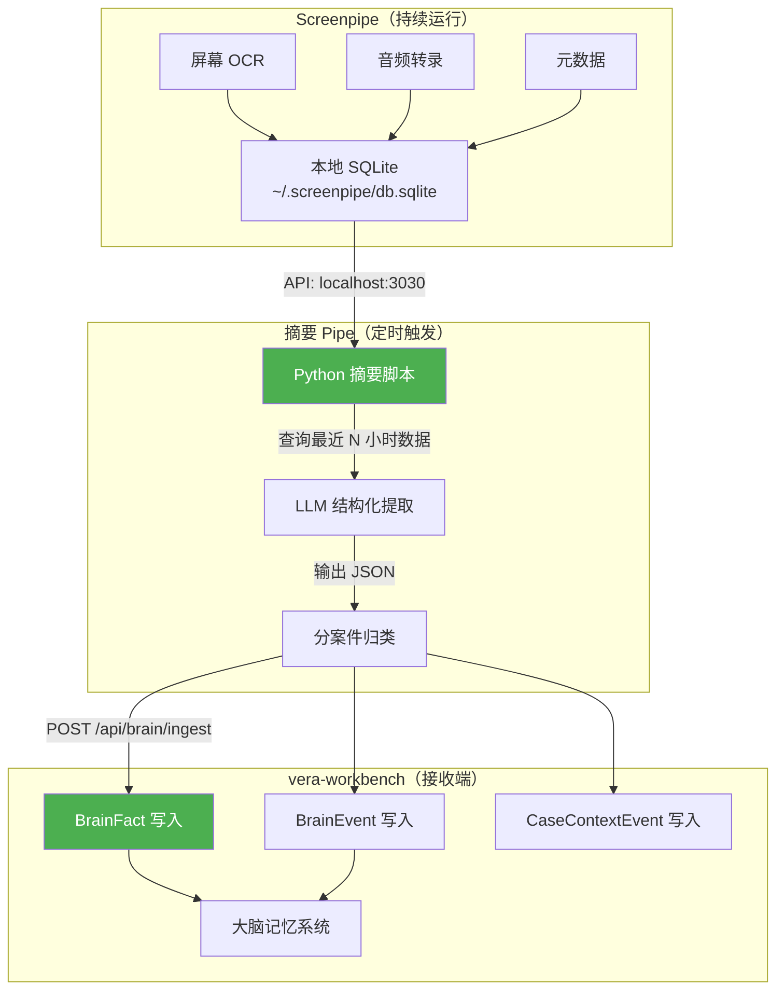

# Screenpipe × CASE 大脑 — 被动录入层构想

> Screenpipe 作为 Vera 电脑操作的"黑匣子"，每半天/每天自动提取工作摘要，喂入 CASE 大脑的记忆系统。

---

## 一、Screenpipe 是什么

[Screenpipe](https://github.com/screenpipe/screenpipe) 是一个开源的本地优先"数字记忆"工具：

```
┌──────────────────── Screenpipe 持续运行 ──────────────────┐
│                                                           │
│  📺 屏幕录制 → OCR 提取文字（看到什么 app、什么网页、什么邮件） │
│  🎤 音频录制 → 语音转文字（会议内容、电话通话）               │
│  ⌨️ 元数据  → 时间戳 + app 名 + 窗口标题                   │
│                                                           │
│  全部存在本地 → ~/.screenpipe/db.sqlite                    │
│  本地 API   → http://localhost:3030                       │
│                                                           │
└───────────────────────────────────────────────────────────┘
```

**核心特点**：
- **Rust 编写**，< 1% CPU，< 400MB 内存
- **纯本地**，数据不上云
- **SQLite 存储**，与我们技术栈天然兼容
- **Pipe 插件系统**，可以定时触发 AI 分析任务
- **内置本地 PII 脱敏模型**
- **Windows/Mac/Linux 全平台**

---

## 二、这个想法为什么极好

### Vera 的日常工作模式

```
8:30  打开 Outlook，处理 20 封邮件
9:00  打开银行网站，查 CBA 利率政策
9:30  Zoom 会议：和客户张三讨论贷款方案
10:30 打开 Excel，更新佣金表
11:00 打电话给银行 Credit Team，问 OS 条件
11:30 回邮件给客户发文件清单
...
```

**现在的问题**：这些信息全在 Vera 脑子里。如果不手动输入系统，AI 什么都不知道。

**Screenpipe 解决的问题**：**Vera 什么都不需要输入。她正常工作，Screenpipe 在后台默默记录。每半天/每天，AI 自动从录制内容中提取有用信息，写入案件记忆。**

这就是构想中说的——**"Vera 不需要被读取，只需要被倾听"** 的终极形态。

---

## 三、三个具体场景

### 场景 1：邮件处理自动录入

```
Vera 打开 Outlook → 阅读 NAB 发来的 Conditional Approval
   ↓
Screenpipe 捕获：
  - app: "Microsoft Outlook"
  - 窗口标题: "RE: Conditional Approval - Chen Wei - NAB"
  - OCR 文字: "Dear Vera, We are pleased to advise conditional 
    approval for your client Chen Wei. Subject to: 
    1. 3 months bank statements  2. Updated payslip  3. ..."
  - 时间: 2026-08-12 09:15:00
   ↓
摘要 Pipe 提取：
  {
    "case_hint": "Chen Wei",
    "bank": "NAB",
    "event": "Conditional Approval received",
    "conditions": ["3 months bank statements", "Updated payslip"],
    "source": "email_outlook"
  }
   ↓
→ 写入 BrainFact：case_id=CASE-ChenWei, key="nab_conditional_approval"
→ 写入 BrainEvent：event_type="system_detected", content="NAB 有条件批准..."
```

### 场景 2：会议/电话自动录入

```
Vera 和客户 Zoom 会议 30 分钟
   ↓
Screenpipe 捕获音频 → 本地转录文字
   ↓
摘要 Pipe 提取：
  {
    "case_hint": "Zhang Fang",
    "participants": ["Vera", "客户 Zhang Fang"],
    "key_decisions": [
      "客户决定不换银行，继续用 ANZ",
      "客户说收入从 PAYG 变成了 Self-Employed"
    ],
    "action_items": [
      "Vera 需要重新拉 BAS 清单",
      "客户下周发 ABN 注册证明"
    ],
    "source": "zoom_meeting"
  }
   ↓
→ 写入 BrainFact：
    - key="bank_decision", value="继续 ANZ，不换", source="vera_meeting"
    - key="employment_type", value="Self-Employed（之前是 PAYG）", 
      supersedes=之前的 PAYG 记录！
→ 写入 BrainEvent：
    - event_type="vera_decided", content="客户决定不换银行"
    - event_type="fact_changed", content="收入类型从 PAYG 变更为 Self-Employed"
```

### 场景 3：每日摘要

```
每天 18:00 触发"每日摘要 Pipe"
   ↓
查询 Screenpipe 当天所有数据
   ↓
AI 生成：
  "今日工作摘要：
   - 处理了 15 封邮件，其中 3 封与 Chen Wei 案件相关
   - 和 Zhang Fang 开了 Zoom 会议，客户改为自雇
   - 查看了 CBA 利率页面 4 次（可能在比较利率）
   - 更新了佣金 Excel
   - 3 个案件有新进展：Chen Wei, Zhang Fang, Li Ming"
   ↓
→ 写入各案件的 BrainEvent 作为当日活动记录
→ 在大脑对话中，AI 第二天可以说：
   "早上好 Vera，昨天你处理了 Chen Wei 的 NAB 批复，
    还和 Zhang Fang 确认了改自雇的事。今天要不要先处理
    Chen Wei 的 3 项 OS 条件？"
```

---

## 四、集成架构



### 关键设计：摘要 Pipe 脚本

```python
# tools/screenpipe_digest.py
# 每半天/每天由 APScheduler 或 Screenpipe Pipe 触发

import requests
from datetime import datetime, timedelta

SCREENPIPE_API = "http://localhost:3030"
VERA_API = "http://localhost:8000"

def run_digest(hours: int = 12):
    """从 Screenpipe 提取最近 N 小时的工作摘要，写入 CASE 大脑。"""
    
    # 1. 查询 Screenpipe 最近 N 小时数据
    start_time = (datetime.now() - timedelta(hours=hours)).isoformat()
    data = requests.get(
        f"{SCREENPIPE_API}/search",
        params={"start_time": start_time, "limit": 200}
    ).json()
    
    # 2. 过滤出贷款相关内容（排除个人浏览等噪音）
    relevant = filter_loan_related(data)
    
    # 3. 用 LLM 提取结构化信息
    extracted = llm_extract_facts(relevant)
    # 输出格式：
    # [
    #   {"case_hint": "Chen Wei", "facts": [...], "events": [...]},
    #   {"case_hint": "Zhang Fang", "facts": [...], "events": [...]},
    # ]
    
    # 4. 匹配案件并写入 vera-workbench
    for case_digest in extracted:
        case_id = match_case(case_digest["case_hint"])
        if case_id:
            for fact in case_digest["facts"]:
                requests.post(f"{VERA_API}/api/brain/ingest", json={
                    "case_id": case_id,
                    "type": "fact",
                    "category": fact["category"],
                    "key": fact["key"],
                    "value": fact["value"],
                    "source": "screenpipe",
                    "confidence": "medium",  # 被动录入置信度低于主动对话
                })
```

---

## 五、PII 安全分析

> [!WARNING]
> Screenpipe 录制的是 Vera 的**完整屏幕**，包含客户姓名、地址、电话、银行账号等大量 PII。

### 安全红线保障

| 层 | 措施 | 说明 |
|----|------|------|
| **L1: Screenpipe 本地** | 数据永不上云 | ~/.screenpipe/db.sqlite 存本地 |
| **L2: Screenpipe PII 模型** | 内置本地 PII 脱敏 | 可配置启用，Rust 运行无需网络 |
| **L3: 摘要 Pipe** | LLM 调用前 desensitize | 用 vera 的脱敏闸门处理后再送 LLM |
| **L4: vera-workbench** | 写入前二次检查 | 现有 leak_guard 拦截 |

```
Screenpipe 原始数据（含 PII）
    ↓ 不出本机
摘要 Pipe 读取
    ↓ desensitize() 脱敏
发送给 LLM 提取
    ↓ 脱敏后的结构化数据
写入 BrainFact（脱敏值）
    ↓ rehydrate() 还原（仅本地展示）
Vera 在前端看到原始信息
```

> [!IMPORTANT]
> **关键原则**：Screenpipe 的原始录制数据（含 PII）永远留在 `~/.screenpipe/db.sqlite`，不传入 vera-workbench。只有经过 LLM 提取的**结构化摘要**（经过脱敏）才写入案件记忆。

---

## 六、落地路线

| 阶段 | 时间 | 内容 |
|------|------|------|
| **0. 安装体验** | 1 天 | 在 Vera 电脑上装 Screenpipe，跑 2-3 天看数据质量 |
| **1. 手动验证** | 2-3 天 | 手写 Python 脚本查询 Screenpipe API，手动看提取效果 |
| **2. 摘要 Pipe** | 3 天 | 写 `screenpipe_digest.py`，LLM 提取 + 案件匹配 |
| **3. 接入 vera** | 2 天 | 新增 `POST /api/brain/ingest` 端点，接收 Pipe 输出 |
| **4. 定时触发** | 1 天 | APScheduler 每半天触发一次 digest |
| **5. 降噪优化** | 持续 | 过滤非业务内容、提高案件匹配准确率 |

> [!NOTE]
> **建议顺序**：先做 CASE 大脑的对话引擎（WO-13），再接 Screenpipe。因为 Screenpipe 是"被动数据源"，大脑是"消费端"——先有消费端，被动数据才有地方存。

---

## 七、Screenpipe 在整体架构中的位置

```
┌──────────────────── 数据录入层 ────────────────────────┐
│                                                         │
│  主动录入（Vera 对话）                                    │
│  ├── 大脑对话（"客户叫张三，要贷 85 万"）                  │
│  ├── 记一笔（快捷录入）                                   │
│  └── 邮件/文件自动触发                                    │
│                                                         │
│  被动录入（Screenpipe） ← 🆕 新增                        │
│  ├── 屏幕 OCR（看到了什么邮件/网页/文档）                  │
│  ├── 音频转录（会议说了什么、电话聊了什么）                  │
│  └── 每日摘要（自动归纳当天工作进展）                       │
│                                                         │
├──────────────────── 记忆引擎 ─────────────────────────────┤
│  BrainFact（结构化事实） + BrainEvent（行为日志）           │
│  → 对话时注入 prompt，AI 记得 Vera 做过的一切              │
│                                                         │
├──────────────────── 消费层 ──────────────────────────────┤
│  大脑对话 / 案件全景 / 每日早报 / 统计分析                  │
└─────────────────────────────────────────────────────────┘
```

---

## 八、待决策点

| # | 决策 | 建议 | 理由 |
|---|------|------|------|
| 1 | Screenpipe 录制范围？ | **只录工作时间**（8:30-18:30） | 避免录到个人生活 |
| 2 | 摘要频率？ | **每半天一次**（12:30 + 18:30） | 太频繁浪费 LLM 调用，太少信息不及时 |
| 3 | 被动录入的置信度？ | **默认 medium** | 低于 Vera 亲口说的（high），高于纯猜测（low） |
| 4 | 被动录入要不要 Vera 确认？ | **不主动弹窗，但在大脑对话中自然提及** | "我注意到你今天看了 CBA 的利率页面，是在考虑给谁换银行吗？" |
| 5 | 音频录制是否启用？ | **Phase 1 先只启用屏幕 OCR** | 音频涉及客户通话隐私，需要客户知情同意 |
| 6 | Screenpipe 的 db.sqlite 要不要定期清理？ | **保留 30 天，之后自动清理** | 避免磁盘爆满 |
