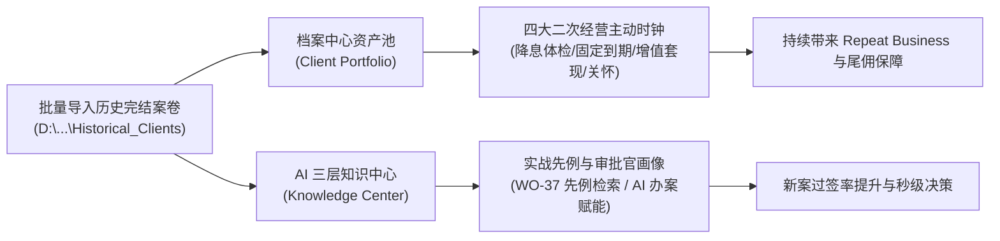
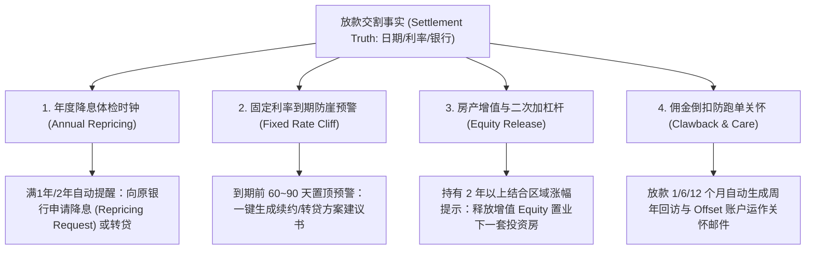

# Vera 工作台 — 历史完结案卷导入与档案中心二次经营总实施框架（资产与知识系统）

本文档为 **Vera 工作台第二阶段专项规划框架**。聚焦于 **“历史完结/已放款客户案卷归档 ➔ 客户终身价值资产沉淀 ➔ 二次经营主动触发 ➔ AI 实战经验与先例智库萃取”**。

> 📌 **实施时机**：待第一阶段（在途作战系统：WO-53 ~ WO-56）全部完工验收并打包后正式启动。

---

## 🏛️ 一、 战略定位与商业价值（Philosophy & Value）

在澳洲 Mortgage Broker 商业模式中：
- **新客获取成本是老客维护的 5~7 倍**；
- 一个成熟经纪人 **60% 以上的稳定收入** 来自存量客户池的 **“二次经营（Retention & Repeat Business）”** 与 **“长期尾佣（Trail Commission）”**。

因此，**历史完结案卷绝不是“沉睡的死档案”，而是 Vera 的“核心数字资产池”与“AI 大脑的智慧基座”**！

---

## 📊 二、 历史案卷导入与在途案件的差异化提取矩阵

虽然底层同样复用 **Layer 0 ~ Layer 3 四层解析引擎**，但历史案卷导入的核心诉求是 **“锁定时钟”** 与 **“萃取经验”**：

| 数据与提取维度 | 在途作战系统（Part 1 关注点） | 历史完结案卷（Part 2 专项提取重点） |
| :--- | :--- | :--- |
| **主入口位置** | 全新建案弹窗 / 案件看板 | **「档案中心 / 客户资产中心（Archive Hub）」** |
| **状态与终态** | 当前进行中阶段、卡点原因（On Hold） | **放款交割日（Settlement Date）**、最终结案状态（Settled/Withdrawn） |
| **信贷方案与利率** | 申请金额、预审利率、计算器预估 | **最终获批利率（Fixed/Variable Rate）**、**固定利率到期日（Fixed Expiry Date）** |
| **二次经营时钟** | 无（案件仍在推进中） | **1. 年度房贷降息体检时钟**（满1年/2年提醒） **2. 固定利率到期转贷预警**（到期前70天） **3. 房产增值再置业时钟**（持有2年以上） **4. 佣金倒扣（Clawback 2年期）关怀时钟** |
| **知识与经验沉淀** | 案件级临时上下文（Case Context） | **1. 全局先例库（Precedent）**：同类客户成功获批路径 **2. 机构与审批官画像**：Rachel 等审批官的真实偏好与审批速度 **3. 踩坑反思（Reflections）**：因估价过低/合规冲突的应对策略 |

---

## ⏰ 三、 档案中心四大二次经营主动时钟（Retention Clocks）

导入历史案卷后，系统后台调度引擎根据放款事实自动激活 **4 大二次经营主动触发器**：

---

## 🧠 四、 AI 知识中心与先例经验沉淀（Knowledge & Precedents）

历史案卷导入时，AI 知识萃取引擎自动提炼三大维度的智慧资产并落库：

### 1. 客户级长期记忆（Client Memory）
- 记录客户的家庭结构变动、偏好、指定会计师（如 `Xiaoli YANG`）；
- 记录历史敏感背景隔离要求（如曾经的关联人债务隔离）；
- **效果**：未来客户再次咨询时，AI 瞬间唤醒全部记忆，提供无缝的 VIP 专属服务体验。

### 2. 机构潜规则与审批官画像（Assessor Insights）
- 自动分析历史 `.msg` 邮件往来，建立审批官画像库：
  - `Rachel Fonseka @ ORDE`：注重签署有效性，对周边 3 套对标成交房源的估价复议高度配合；
  - `Brighten`：必须先付估价费才排期；
  - `Latrobe`：Lite Doc 需警惕合规利益冲突。

### 3. 实战先例库（Precedent Search - WO-37 底座）
- 将历史成功批复案例转化为向量经验沉淀在 Mem0 知识库中；
- 当新案进件时，AI 自动匹配历史相似案卷：
  - *“参考 2026 年 Yingkun CHEN 案（ABN 满1年，年税前 $492k 自雇 Alt Doc），在 ORDE 成功批复 $1.84M。”*

---

## 🖥️ 五、 档案中心（Archive & Retention Hub）前后端重构方案

### 1. 后端重构内容
1. **历史案卷批量入库管道（Batch Archive Ingestion）**：
   - 支持指定包含数十个历史客户的主目录，多线程并行扫描入库；
   - 自动解析批复函（Approval Letter）与交割单（Settlement Statement），锁定放款日期与利率。
2. **二次经营调度引擎（Retention Scheduler）**：
   - 每日定时轮询已放款案件，计算距离放款周年、固定到期天数，自动向 Vera 推送任务与草稿。
3. **AI 知识萃取与蒸馏（Knowledge Mining）**：
   - 提取各案经验总结，生成 `KnowledgeEntry` 并打入全局先例库。

### 2. 前端界面重构内容
1. **客户终生资产视图（Client Portfolio View）**：
   - 以“客户”为卡片主体，汇总展示名下所有历史房产、贷款总额、当前利率与在保状态。
2. **二次经营商机雷达（Retention Radar 看板）**：
   - 🔴 **高危到期区**：未来 90 天内固定利率即将到期的客户清单（一键生成转贷方案）；
   - 🟡 **降息体检区**：放款满 1 年以上且利率高于市场均值的客户清单（一键向银行发起 Repricing）；
   - 🟢 **增值潜力区**：持有 2 年以上、具备二次置业/套现能力的优质客户池。
3. **实战先例与经验检索面板（Precedents Explorer）**：
   - 像搜索引擎一样，支持按“银行（ORDE/CBA）”、“收入类型（Alt Doc）”、“物业类型”瞬间召回所有历史成功批复案例。

---

## 🚦 六、 第二阶段实施路线图（Roadmap - Phase 2）

| 批次 | 核心任务 | 施工单规划 | 前端提示词 |
| :--- | :--- | :--- | :--- |
| **批次一 (WO-57)** | **历史案卷批量入库管道与放款事实解析** | `wo-57-archive-batch-ingestion.md` | **提示词 P5**：档案中心批量导入历史案卷弹窗与放款事实 |
| **批次二 (WO-58)** | **二次经营时钟引擎与主动商机看板** | `wo-58-retention-scheduler.md` | **提示词 P6**：档案中心二次经营商机雷达看板（红黄绿预警） |
| **批次三 (WO-59)** | **AI 知识萃取与审批官/先例图谱** | `wo-59-knowledge-precedent-mining.md` | **提示词 P7**：知识中心审批官画像卡片与实战先例检索面板 |
| **批次四 (WO-60)** | **档案中心全景重构与最终交付** | `wo-60-archive-hub-redesign.md` | **提示词 P8**：档案中心整体界面重构定稿与体验收口 |
