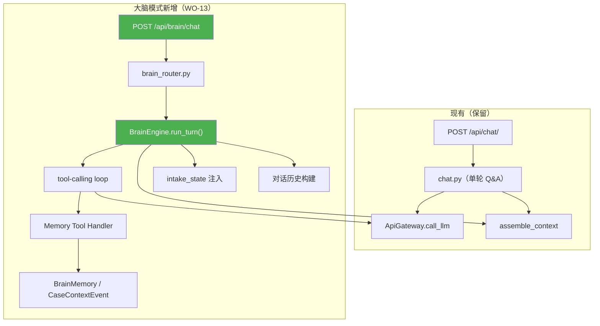

# CASE 大脑架构转型 — 深度分析与完善建议（v2）

> 基于对 [CASE大脑_产品定位与Phase1构想.md](file:///D:/vera-workbench/docs/CASE大脑_产品定位与Phase1构想.md) 的逐条审读，以及对整个代码库（后端 core/、server/、prompts/）和全部 10 份 [flash_specs](file:///D:/vera-workbench/docs/flash_specs) 施工单（WO-03 到 WO-12）的交叉验证。

---

## 一、战略判断：这是一个正确的方向转变

### 核心洞察准确

构想文档中的一句话——**"Vera 不需要被读取，只需要被倾听"**——抓住了真正的痛点。回顾 BACKLOG 中的演变轨迹：

```
任务工作台(WO-04/08) → 案件记录本(BACKLOG V1) → CASE 大脑(新构想)
```

每一次转向的本质都是在**降低 Vera 的适配成本**。从"系统驱动人"到"人驱动系统"再到"人和 AI 自然对话"，这是正确的演化路径。

### 但有一个关键认知需要校准

> [!IMPORTANT]
> 构想中说"Phase 1 纯粹打造一个 AI 助手"——这其实不是从零开始，而是**把已有的被动式 AI（回答问题）升级为主动式 AI（引导对话）**。现有代码库已经具备 80% 的后端基础设施。这不是推倒重来，而是换一个"前端入口 + 对话引擎层"。

---

## 二、Flash Specs 施工单 × 大脑构想：全量影响分析

这是最关键的一节——10 份施工单在大脑转型下各自的命运。

### 总览

| 施工单 | 标题 | 状态 | 大脑转型下的命运 |
|--------|------|------|-----------------|
| [WO-03](file:///D:/vera-workbench/docs/flash_specs/wo-03-api-routes.md) | API 路由层 | ✅ 已完成 | **保留 + 新增** `/api/brain/` 路由 |
| [WO-04](file:///D:/vera-workbench/docs/flash_specs/wo-04-frontend-v5.md) | 前端工作台 | ✅ 已完成 | **主体降级** — 任务工作台不再是主界面，BrainChat 取代 |
| [WO-05](file:///D:/vera-workbench/docs/flash_specs/wo-05-electron.md) | Electron 壳 | ❌ 未做 | **延后不变** — 和大脑转型无关，时序不变 |
| [WO-06](file:///D:/vera-workbench/docs/flash_specs/wo-06-cloud-sync.md) | 云同步 | ❌ 未做 | **延后不变** — 和大脑转型无关 |
| [WO-07](file:///D:/vera-workbench/docs/flash_specs/wo-07-tests-clientid.md) | 测试体系 | ✅ 已完成 | **保留 + 扩展** 大脑引擎测试 |
| [WO-08](file:///D:/vera-workbench/docs/flash_specs/wo-08-task-engine.md) | 任务引擎 | ✅ 已完成 | **⚠️ 需要重新定位** — 从"主角"降级为"大脑的后台工具" |
| [WO-09](file:///D:/vera-workbench/docs/flash_specs/wo-09-checklist-summary.md) | 清单 + 摘要 | ✅ 已完成 | **保留** — 清单逻辑被大脑作为"查询工具"调用 |
| [WO-10](file:///D:/vera-workbench/docs/flash_specs/wo-10-infra-scheduler.md) | 基础设施 | ❌ 未做 | **部分需要** — 备份/调度仍需做，pipeline 优化可延后 |
| [WO-11](file:///D:/vera-workbench/docs/flash_specs/wo-11-wechat-drafts.md) | 微信 + 草稿 | ❌ 未做 | **延后** — 微信=未来工具包中的一个工具 |
| [WO-12](file:///D:/vera-workbench/docs/flash_specs/wo-12-migration-release.md) | 迁移 + 发布 | ❌ 未做 | **延后不变** |

### 逐项详细分析

---

#### WO-03 API 路由层 — ✅ 保留，新增大脑路由

**现有端点全部保留**（cases/tasks/files/inbox/chat/drafts/admin/events），但需新增：

```
POST /api/brain/chat       ← 大脑对话（多轮 + tool-calling）
GET  /api/brain/history    ← 大脑对话历史
GET  /api/brain/memories   ← 案件记忆列表
POST /api/brain/memories/{id}/confirm  ← 确认记忆
POST /api/brain/memories/{id}/revoke   ← 撤销记忆
GET  /api/brain/intake-state/{case_id} ← 建档进度
```

现有 `POST /api/chat/` 保留作为兼容路径（非大脑模式的简单 Q&A）。

---

#### WO-04 前端工作台 — ⚠️ 主体定位重大变化

这是**受冲击最大的施工单**。WO-04 用 1227 行定义了一个以"任务队列"为核心的工作台 UI，包含 8 种任务卡、KPI Bar、FilterBar、深度工作模式等。

**大脑转型后的变化**：

| WO-04 设计 | 大脑模式下的命运 |
|-----------|-----------------|
| TaskList（380px 左栏）— 8 种任务卡 | **降级为侧栏/标签页**，不再是主视图 |
| DetailPanel（右栏）— 各类型详情面板 | **保留**，但从"主面板"变为"上下文面板" |
| AIChatPanel（详情面板底部输入） | **升级为 BrainChat**，从底部小框变为主界面 |
| KPI Bar（顶部统计 pill） | **保留** |
| FilterBar（6 个筛选标签） | **可保留**，但不再是核心交互 |
| CaseBoard（看板页） | **保留**，看板是独立维度 |
| 5 套主题 | **保留** |

> [!WARNING]
> WO-04 的设计哲学是 **"任务驱动，AI 辅助"**（AI 在详情面板底部），大脑构想是 **"AI 驱动，任务辅助"**（AI 是主界面，任务在侧栏）。这是 180° 的主次反转。前端需要一个新的布局方案。

**建议的新布局**：

```
┌──────────────────────────────────────────────────────┐
│ app-shell                                             │
├────────┬─────────────────────────────────────────────┤
│        │ main-content                                 │
│ Sidebar│ ┌──────────────────────────────────────────┐│
│ 60px   │ │ KPI Bar (保留)                            ││
│ 图标   │ ├──────────────────────────────────────────┤│
│        │ │ CaseSelector (顶部案件切换下拉)           ││
│ + 新增 │ ├─────────────────┬────────────────────────┤│
│ "大脑" │ │ BrainChat       │ ContextSidebar         ││
│  图标  │ │ (主对话区)       │ (全景/记忆/任务)       ││
│        │ │ flex: 1         │ 360px, 可折叠           ││
│        │ │                 │ ┌ 案件全景 ─────────┤  ││
│        │ │                 │ ├ 记忆列表(确认/撤销)┤  ││
│        │ │                 │ ├ 待办任务 ─────────┤  ││
│        │ │                 │ └──────────────────┤  ││
│        │ └─────────────────┴────────────────────────┘│
└────────┴─────────────────────────────────────────────┘
```

- Sidebar 新增一个 "🧠 大脑" 图标作为默认首页
- 原有的 "任务工作台" 图标保留，点进去仍是 WO-04 设计的 TaskList+Detail
- **BrainChat 是新的默认首页**

---

#### WO-08 任务引擎 — ⚠️ 从"主角"变"配角"

WO-08 的设计目标是"V5 的灵魂"：`create_task` → `dispatch_task` → 委派 → 老板决策 → SSE。

大脑模式下：

- **`create_task`** → 仍然需要，但触发方式从"邮件/文件到达 → 自动创建任务"变为"大脑对话中 AI 建议 → Vera 确认 → 创建任务"
- **`dispatch_task`** → 从"UI 三键派单"变为"对话中确认"
- **委派 (`delegation.py`)** → 保留，但触发方式变了（对话中说"这个让 Judy 跟进"→ AI 调用委派工具）
- **`boss_decision.py`** → 保留
- **SSE (`sse.py`)** → **更重要了**——大脑对话需要 streaming 回复

```
WO-08 原设计：邮件到 → 创建任务卡 → Vera 看队列 → 三键派单
大脑模式：  Vera 聊天说进展 → AI 建议创建待办 → Vera 确认 → 任务创建
```

> [!NOTE]
> WO-08 的所有代码保留（dispatcher/delegation/boss_decision），但它们从"前台驱动"变为"后台工具"——被大脑引擎通过 function calling 调用。

---

#### WO-09 清单 + 摘要 — ✅ 完全保留

清单和摘要在大脑模式下更有用了：
- `pick_checklist` → 建档流程中 AI 自动调用（"根据你说的情况，我给这个客户选了 18 项清单"）
- `generate_case_summary` → 每次对话结束时刷新一句话摘要
- `reverse_match` → Phase 2+ 文件工具接入时才用

---

#### WO-10 基础设施 — 部分需要

| WO-10 内容 | 大脑模式下 |
|-----------|-----------|
| APScheduler + SQLite 备份 | **需要做** — 与大脑无关但重要 |
| PII 金额不脱敏 | **需要做** — 大脑对话中客户说"85 万"，脱敏后 AI 看不到金额影响建议质量 |
| Pipeline 优化（OCR/HEIC/两阶段分类） | **可延后** — Phase 1 不碰文件 |
| `ingest_file()` 统一入口 | **延后** — Phase 1 不碰文件 |

**建议**：WO-10 拆为 10a（备份+调度+PII，和大脑一起做）和 10b（Pipeline，延后）。

---

#### WO-11 微信 + 草稿 — 延后，未来作为工具包

大脑构想第五节"工具包架构"中明确列出微信工具在 Phase 2+ 路线。
- `wechat/handler.py` → 未来注册为 BrainTool
- `drafts/conversation_refine.py` → 大脑对话本身就是"对话修正"，可能部分复用

---

#### WO-05/06/12 — 延后不变

Electron 桌面壳、云同步、迁移发布 — 这些与大脑转型正交，时序不变。

---

## 三、现有资产盘点：哪些能直接复用，哪些需改造

### ✅ 直接复用（零改动或极小改动）

| 模块 | 文件 | 能力 |
|------|------|------|
| PII 脱敏闸门 | [gateway.py](file:///D:/vera-workbench/core/pii/gateway.py) + [leak_detector.py](file:///D:/vera-workbench/core/pii/leak_detector.py) | desensitize/rehydrate + 泄漏检测 |
| AI 网关 | [gateway.py](file:///D:/vera-workbench/core/ai/gateway.py) | 已支持 tool_calls 参数（L138-139），**已预埋 function calling** |
| 上下文蒸馏 | [accumulator.py](file:///D:/vera-workbench/core/context/accumulator.py) | CaseContextEvent → LLM 蒸馏 → context_summary，双轨 |
| 统一上下文 | [case_context.py](file:///D:/vera-workbench/core/ai/case_context.py) | build_case_context() 产出结构化字典 |
| 上下文组装器 | [context_builder.py](file:///D:/vera-workbench/core/ai/context_builder.py) | 四层架构 + token 预算管理 |
| 数据模型 | [orm.py](file:///D:/vera-workbench/core/models/orm.py) | Case 字段已就绪（client_goal/special_circumstances/context_summary/internal_notes） |
| 统计分析 | [analytics.py](file:///D:/vera-workbench/server/api/analytics.py) | 四端点已实现 |
| 任务引擎 | [dispatcher.py](file:///D:/vera-workbench/core/task_engine/dispatcher.py) + [delegation.py](file:///D:/vera-workbench/core/task_engine/delegation.py) | 从前台入口变为大脑工具 |

### 🔧 需要改造的部分

| 模块 | 当前状态 | 大脑模式需要 |
|------|---------|-------------|
| Chat API | [chat.py](file:///D:/vera-workbench/server/api/chat.py)：无状态单轮 Q&A | **多轮对话 + tool calling 闭环** |
| System Prompt | 硬编码一句话（L23） | **人格化 persona + 主动询问编排** |
| 对话历史 | CaseChatMessage 只做日志 | **滑动窗口注入 LLM** |
| AI Gateway `_do_call` | 单轮调用（L239） | **tool-call → execute → 回传循环** |

### ❌ 缺失的部分（需新建）

| 能力 | 说明 |
|------|------|
| **对话引擎 (BrainEngine)** | 多轮 function calling + 历史注入 + 状态机 |
| **建档状态机 (IntakeFlow)** | 管理"问到哪一步了" |
| **记忆工具 (MemoryTools)** | LLM function calling 的 save/confirm/revoke/query |
| **BrainChat 前端** | 替代 ChatPanel 的对话主界面 |

---

## 四、构想文档的 6 个需要深化的问题

### 问题 1：主动询问的"流程编排"如何实现？

构想说"内置建档/跟进流程"，但没定义实现机制。

| 方案 | 描述 | 优劣 |
|------|------|------|
| **A. Prompt 编排** | 流程嵌入 system prompt，LLM 自行判断 | ✅ 最简单，⚠️ LLM 可能跳步/忘记已问过的 |
| **B. 状态机 + Prompt** | 后端维护 `intake_state` JSON，每轮注入 | ✅ 可控可审计，⚠️ 需新建模 |
| **C. 多 Agent** | 主 agent 调度 intake_agent / followup_agent | ❌ Phase 1 过重 |

> [!TIP]
> **建议方案 B**。Case 新增 `intake_state` (JSON) 字段，存 `{"collected": {"name": "张三", "bank": "CBA"}, "step": "income_type"}`。每轮注入 prompt 告诉 AI 已知/待问信息。

### 问题 2：聊天记录不注入 prompt 是致命缺陷

当前 [chat.py](file:///D:/vera-workbench/server/api/chat.py) 只发当前消息 + 上下文，不含对话历史。

> [!WARNING]
> 没有对话历史注入，主动询问流程无法工作。AI 每轮"失忆"，无法实现连续对话。

### 问题 3：Function Calling 闭环缺失

AI Gateway 已支持 tools 参数（[L138-139](file:///D:/vera-workbench/core/ai/gateway.py#L138-L139)），已解析 tool_calls 返回值（[L256-269](file:///D:/vera-workbench/core/ai/gateway.py#L256-L269)）。**但没有 tool → execute → 结果回传 → 再调用 LLM 的循环。**

### 问题 4：确认/撤销机制的数据模型不够明确

建议新增 `BrainMemory` 表，存结构化键值对（AI 从对话提取的客户信息字段），与 `CaseContextEvent`（非结构化事件流）互补。BrainMemory 确认后自动写入 CaseContextEvent。

### 问题 5：与现有 BACKLOG V1 冲刺的冲突

当前 BACKLOG V1 冲刺（S0-S5）和大脑构想有结构性矛盾。建议不废弃 BACKLOG，而是**在 S1 之后插入"Phase 0.5: 大脑验证"阶段**。S1 的"记一笔"保留作为非 AI 路径兜底。

### 问题 6：人格化 Persona 需要具体定义

阶段 0 给 3 个人格候选让 Vera 选。详见第六节"对构想文档的修改建议"。

---

## 五、WO-13 大脑引擎施工单草案

基于 flash_specs 的统一体例，大脑引擎应作为 **WO-13** 发布。草案结构：

```markdown
# 施工单 13：CASE 大脑引擎 + BrainChat

> 执行者：Antigravity
> 依赖：WO-03（API 路由）✅ + WO-08（任务引擎）✅ + WO-09（清单/摘要）✅
> 预估：5 天（含阶段 0 验证）

## 改动范围

| 文件 | 操作 | 说明 |
|------|------|------|
| core/brain/__init__.py | 新建 | — |
| core/brain/engine.py | 新建 | BrainEngine（多轮 tool-calling 对话引擎） |
| core/brain/persona.py | 新建 | Persona 管理（system prompt 构建） |
| core/brain/intake_flow.py | 新建 | 建档/跟进状态机 |
| core/brain/memory_tools.py | 新建 | Function calling 工具定义 + handler |
| core/brain/memory_store.py | 新建 | BrainMemory CRUD |
| core/models/orm.py | 修改 | +BrainMemory 表 + Case.intake_state |
| server/api/brain.py | 新建 | 大脑路由（/api/brain/chat + memories） |
| prompts/brain_persona.txt | 新建 | 人格化 system prompt 模板 |
| tests/test_brain_engine.py | 新建 | 引擎测试 |
| tests/test_brain_memory.py | 新建 | 记忆 CRUD 测试 |
| tests/test_brain_intake.py | 新建 | 建档流程测试 |

## 阶段

| 阶段 | 天数 | 内容 |
|------|------|------|
| 13a | 2 天 | 阶段 0 黑盒验证（改 system prompt + 手动历史拼接） |
| 13b | 2 天 | BrainEngine + MemoryTools + 后端路由 |
| 13c | 1 天 | IntakeFlow 状态机 + BrainMemory 模型 |

## 技术约束
- Python 文件行数 ≤ 200
- AI 调用必须经过 core.pii.gateway.desensitize()
- 对话历史滑动窗口 ≤ 10 轮
- BrainMemory 确认后必须写入 CaseContextEvent
- 不引入新的 pip 依赖
```

---

## 六、BACKLOG 统一更新建议

大脑构想成熟后，BACKLOG 需要一次性更新。建议的修改：

### BACKLOG 顶部新增

```markdown
## V1.5 大脑模式（2026-08-xx 定稿，产品主线升级）

> 原则：从"案件记录本"升级为"CASE 大脑"。AI 从被动回答变为主动引导。
> 与 V1 的关系：V1 所有后端资产保留；前端从"任务工作台"变为"对话大脑"。

| 做 | 说明 |
|----|------|
| ✅ BrainChat 对话主界面 | 替代 ChatPanel，支持确认/撤销/记忆卡片 |
| ✅ 主动询问（建档/跟进） | AI 引导收集客户信息，边问边记 |
| ✅ 记忆工具 | save/confirm/revoke/query（function calling） |
| ✅ 人格化 Persona | 稳定性格 + 记忆人格 |
| ⏸️ 任务工作台 | 降级为侧栏/标签页（代码保留） |
```

### 施工单编号体系

```
WO-01~12: 原有（保留）
WO-13: 大脑引擎（新增）
WO-14: BrainChat 前端（新增，WO-04 的"大脑版 Prompt"）
```

---

## 七、补充的架构建议

### 对话引擎与现有 Chat API 的关系



### 文件结构建议

```
core/
  brain/                    ← WO-13 新建
    __init__.py
    engine.py               # BrainEngine（多轮 tool-calling）
    persona.py              # Persona（system prompt 构建）
    intake_flow.py          # 建档/跟进状态机
    memory_tools.py         # Function calling 工具定义 + handler
    memory_store.py         # BrainMemory CRUD
  ai/
    gateway.py              # 现有不改（或小幅增加 streaming）
    context_builder.py      # 现有不改
    case_context.py         # 现有不改
  context/
    accumulator.py          # 现有不改（BrainMemory 确认后调用）
  task_engine/              # 现有保留，变成大脑可调用的工具
    dispatcher.py
    delegation.py
    boss_decision.py

server/api/
    brain.py                # WO-13 新建：BrainChat 路由
    chat.py                 # 现有保留（兼容）
```

---

## 八、修订后的落地路线

| 阶段 | 时间 | 内容 | 关键产出 |
|------|------|------|---------|
| **0 黑盒验证** | 2-3 天 | 改 system prompt + 手动历史拼接，Vera 真机试 | Go/No-Go 决策 |
| **1a 大脑骨架-后端** | 1 周 | WO-13: `core/brain/` + BrainMemory + `/api/brain/chat` | 后端可测 |
| **1b 大脑骨架-前端** | 1 周 | WO-14: BrainChat 组件（增强 ChatPanel + 确认/撤销 + 记忆卡片） | Vera 可用 |
| **1c 主动询问** | 3-5 天 | intake_flow 状态机 + 建档 8 字段 + 跟进流程 | 核心体验成型 |
| **2 体验打磨** | 1 周 | 全景侧栏 + 统计对话入口 + 记忆管理 | 完整闭环 |
| **3 WO-10a** | 3 天 | 备份 + 调度 + PII 金额保留 | 基础设施 |
| **4 CopilotKit spike** | 1 周（可选） | 评估动作渲染 + React 19 兼容 | 引入/不引入 |
| **5 工具包** | 按需 | WO-11 微信 → 日历 .ics → 文件佐证 | 渐进增强 |

---

## 九、待 Vera 决策的修订清单

| # | 决策点 | 建议 | 理由 |
|---|--------|------|------|
| 1 | 纯对话 vs 对话+仪表盘 | **对话+仪表盘** | build_case_context() 已产出结构化数据 |
| 2 | AI 记录确认策略 | **高置信直接记+可撤销** | 采用构想建议 |
| 3 | 任务卡去留 | **降级为侧栏**（WO-04/08 代码保留） | task_engine 变大脑工具 |
| 4 | CopilotKit 时机 | **阶段 2 后评估** | 先验证纯 function calling |
| 5 | 人格设定 | **阶段 0 给 3 候选** | Vera 定 |
| 6 | 主动询问节奏 | **一次 1 题，关联追问** | 避免轰炸 |
| 7 | **WO-04 前端主界面** | **BrainChat 取代 TaskList 成为默认首页** | 核心转变 |
| 8 | **WO-08 任务引擎** | **保留代码，从前台入口变为后台工具** | 不浪费已有资产 |
| 9 | **BACKLOG 更新时机** | **阶段 0 验证通过后统一更新** | 避免过早改动 |

---

## 十、风险补充

| 风险 | 影响 | 防线 |
|------|------|------|
| **LLM 延迟** | >5 秒 Vera 失去耐心 | Streaming (SSE) + 低延迟模型 |
| **对话历史超限** | token 超窗口 | 滑动窗口 10 轮 + 蒸馏摘要 |
| **大脑 vs 记录本切换混乱** | 两套录入并存 | "记一笔"始终可用 = 绕过 AI 快捷通道 |
| **function calling 不稳定** | 不同 provider 格式差异 | fallback 为纯文本对话 |
| **WO-04 前端大改风险** | 已做完的前端工作被浪费 | 不删代码，只改默认路由 + 新增 BrainChat 页 |

---

## 十一、总结

这份构想的**方向正确、时机合适**，且与现有代码库的兼容性极好。

从 10 份施工单的全量分析来看：
- **6 份已完成的 WO（03/04/07/08/09）全部保留**，其中 WO-08（任务引擎）从主角降级为配角
- **4 份未做的 WO（05/06/11/12）延后时序不变**
- **WO-10 拆分**：备份+PII 提前做，Pipeline 延后
- **新增 WO-13（大脑引擎）+ WO-14（BrainChat 前端）**

关键新增量只有 6 个后端文件 + 1 个路由 + 1 个数据模型 + 1 个前端页面。**最大的风险不是技术，而是阶段 0 的验证**——Vera 是否接受"被 AI 主动问"的交互方式决定一切。
