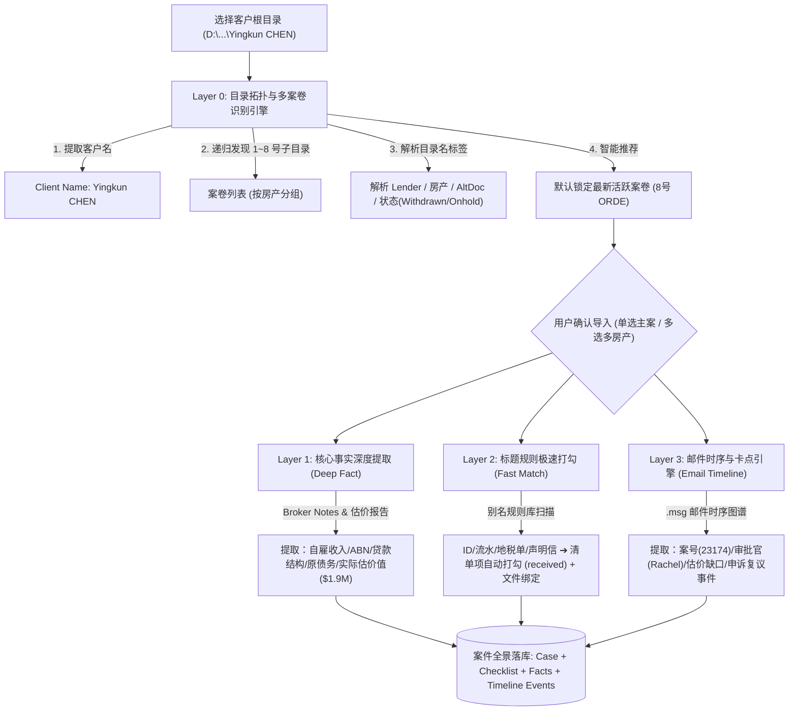

# Vera 工作台 — 案件文件夹智能解析与建档总实施框架（在途作战系统）

本文档结合 **Vera 工作台前后端现有架构** 与真实客户案卷（如 `Yingkun CHEN`）的业务实践，聚焦于 **“日常全新建档 + 存量在途案件极速导入”**，将**「一客户多案件识别 + 核心文档深度解析 + 标题快速匹配打勾 + 邮件时序与卡点定性 + 新建建档交互重构」**提炼为完整落地的工程化实施框架。

> 📌 **战略分工说明**：
> - **第一部分（本框架文档）**：在途作战系统 ➔ 聚焦于 Vera 日常高频全新建档、在途案件快速导入与材料自动打勾；
> - **第二部分（独立框架文档）**：历史档案与二次经营系统 ➔ 详见 [`docs/CASE大脑_历史完结案卷导入与档案中心二次经营总实施框架.md`](file:///d:/vera-workbench/docs/CASE大脑_历史完结案卷导入与档案中心二次经营总实施框架.md)。

---

## 🏗️ 一、 核心领域模型与建档入口权重（Domain & Priority）

### 1. 客户与案卷的“一对多”拓扑层级
在澳洲信贷业务中，客户根目录与各案卷子目录具有天然的层级从属关系：

```
📁 客户主体 (Client Level: D:\...\Yingkun CHEN)
 ├── 客户级全局面谈需求: Meeting Notes 14.04.2026.docx
 │
 ├── 🏠 房产 A 案件链条 (84 Louis Street, Granville)
 │    ├── 1. Refinance & cash out - ORDE (初次递交) ➜ [已归档 Case]
 │    ├── 2. Resub ... - Zank Financial - Withdrawn ➜ [撤回 Case]
 │    ├── 7. Refi & cash - Latrobe (Lite Doc) - onhold ➜ [暂停 Case]
 │    └── 8. Refi & cash - ORDE小号 - 84 Louis St (Alt doc) - onhold due to poor val 
 │         └── 【当前活跃主 Case (Active)】
 │
 └── 🏢 房产 B 独立案件 (如新购房/商业贷)
      └── 9. Purchase - 12 Station St, Parramatta ➜ 【并行独立 Case】
```

- **客户主体（Client）**：姓名 `Yingkun CHEN`，持有全局身份（护照/PR/ABN）及基本面。
- **案件（Case）**：每个带序号的子文件夹对应数据库中的一个独立 `Case` 实例（独立 `case_id`、独立材料清单 `Checklist`、独立路径 `folder_path`、独立审批阶段与状态）。

---

### 2. 界面建档入口的双通道权重（Dual-Track Hierarchy）

根据 Vera 的日常实际业务节奏，明确区分高频日常操作与过渡性操作：

```
┌──────────────────────────────────────────────────────────┐
│  新建贷款案件 (New Loan Case)                              │
├──────────────────────────────────────────────────────────┤
│                                                          │
│  [ ★ 全新客户 / 案件录入 (默认第一主入口) ]  [ 📂 存量案卷批量迁移 ] │
│                                                          │
│  ┌─ 通道 A: 全新空白录入 (日常高频 365 天主场景) ───────┐  │
│  │ 1. 借款人画像: 姓名、身份状态 (PR/Citizen)、雇佣类型   │  │
│  │ 2. 意向贷款方案: 目标银行、贷款类型、预估借款金额     │  │
│  │ 3. 抵押物业信息: 房产地址、预估价值                  │  │
│  │                                                    │  │
│  │ 📁 自动创建本地标准工作目录:                         │  │
│  │    存放父目录: [ D:\EverStones_Clients\ ] [更改...] │  │
│  │    自动生成: D:\...\Yingkun CHEN\1. Refi-ORDE-84... │  │
│  │    (内置 Send to Lender / Approval / Valuation 等)  │  │
│  └────────────────────────────────────────────────────┘  │
│                                                          │
│  ┌─ 通道 B: 存量案卷自适应导入 (上线初期快速迁入在途案) ─┐  │
│  │ 选择客户根目录 ➔ 毫秒级拓扑扫描 ➔ 展示多房产案卷卡片   │  │
│  │ 自动勾选活跃案 ➔ 自动回填画像 ➔ 一键批量导入建档      │  │
│  └────────────────────────────────────────────────────┘  │
│                                                          │
│                          [ 取消 ]  [ 立即创建并打开案件 ➔ ]│
└──────────────────────────────────────────────────────────┘
```

- **通道 A（全新建档 - 默认首选）**：Vera 每天接待新咨询时使用。几秒录完核心 10 个字段，系统自动在本地硬盘脚手架生成标准 11 个子目录。
- **通道 B（存量导入 - 过渡通道）**：用于上线初期一次性把在办在审的案子整齐搬进系统。
- **彻底废除“三种录入粒度”旧设计**：不再让用户手动选择“建壳/预填/全量”，系统全部采用自适应最高完整度管道（有 Notes 抽画像，有材料自打勾，有邮件建时序）。

---

## ⚙️ 二、 数据流转与四层解析中枢架构



---

### 🔍 Layer 0: 目录拓扑与多案卷识别引擎 (`core/case_folder/topology.py`)
1. **客户主体识别**：取客户根目录文件夹名称（如 `Yingkun CHEN`）。
2. **多案卷解析正则（Folder Name Regex）**：
   - 提取序号：`^(\d+)\.\s*`
   - 提取重递标记：`Resub\s*-\s*`
   - 提取业务类型：`Refinance & cash out` / `Purchase` / `Commercial`
   - 提取目标机构（Lender）：`ORDE` / `Zank Financial` / `Brighten` / `Latrobe` 等
   - 提取房产地址：`84 Louis Street, Granville NSW 2142`
   - 提取方案类型：`(Alt Doc)` / `(Lite Doc)` / `(Full Doc)`
   - 提取显式状态与卡点：`Withdrawn`（撤回）、`onhold due to poor val`（估值低暂停）、`Val Fees Not Paid`（欠费暂停）、`onhold due to conflict`（冲突暂停）。
3. **案卷分组与活跃度排序**：按房产地址聚合，同房产下按序号最大、修改时间最新、非 Withdrawn 状态排在最前作为推荐默认案卷。

---

### 📄 Layer 1: 核心事实深度抽取 (`core/facts/prefill.py`)
只针对极少数核心文档做深度阅读，精准提取数值与文字事实，写入 `brain_facts` 及 `Case`：
1. **`Broker Notes.docx/pdf`**（优先解析）：
   - 借款人与公司画像：自雇公司 `J & Q CONSTRUCTION PTY LTD`、ABN、行业 `Landscaping`、年应税收入 `$492,865`、婚姻与身份（Single, PR）。
   - 贷款结构：`Prime Alt Doc OO P&I`、利率 `6.89%`、金额 `$1,840,000`、LVR `80%`、年限 `30`。
   - 原贷款负债（待结清）：`Zank Financial` 房贷余额 `$1,662,172.83`、信用卡 `$1,000`。
   - 特殊策略（Admin Notes）：隔离历史关联人信息、指定会计师 `Xiaoli YANG`。
2. **`Property Val - *.pdf`**（估价报告）：
   - 提取实际估价值（如 `$1,900,000`），与预期估值（`$2,300,000`）形成事实对比，计算额度缺口。
3. **`Application Summary.pdf`**：
   - 提取递交申请表上的平台案号与递交明细。

---

### ⚡ Layer 2: 标题规则极速打勾引擎 (`core/checklist/matcher.py`)
无需昂贵 OCR 与 LLM，直接利用**别名规则库 + 目录优先级**对支持性材料毫秒级打勾并绑定文件：

```python
CHECKLIST_ALIAS_MAP = {
    # 身份证明类
    "driver_licence": ["dl", "driver license", "driver licence", "驾照"],
    "passport": ["passport", "护照"],
    "visa_vevo": ["visa", "vevo", "155", "189", "190", "500", "820", "801", "签证"],
    "voi": ["voi", "id voi", "verification of identity"],
    "credit_consent": ["credit_check", "client_consent", "privacy consent", "征信授权"],
    
    # 资产与负债类
    "council_rates": ["rate notice", "rates notice", "council rate", "地税", "市政费"],
    "home_loan_statement": ["liability hl", "loan statement", "mortgage statement", "hl 流水", "房贷流水"],
    "credit_card_statement": ["credit card", "cc statement", "信用卡流水"],
    
    # 自雇与收入类
    "se_declaration": ["se declaration", "self certified", "income declaration", "自雇声明"],
    "accountant_letter": ["accountant", "cpa letter", "会计信", "会计师声明"],
    "company_search": ["company search", "asic search", "abn lookup", "公司查册"],
    
    # 估价与建议书
    "valuation_report": ["property val", "valuation report", "估价报告"],
    "soca": ["soca", "credit advice", "statement of credit advice"],
}
```

- **执行逻辑**：
  1. 遍历案卷的 `Send to Lender/`、`To be signed/`、`Valuation/` 等目录；
  2. 匹配命中的文件自动登记进 `processed_files`（`CaseFile`）；
  3. 将对应清单项的 `CaseChecklist.status` 置为 `"received"`，并将 `file_id` 填入 `received_file_ids`；
  4. 瞬间完成全案 90%+ 材料的打勾闭环。

---

### 📬 Layer 3: 邮件时序与卡点提炼引擎 (`core/pipeline/msg_timeline.py`)
扫描案卷内的所有 `.msg` 邮件文件，提取时序与关键业务动态：
1. **邮件时序提取**：
   - 提取 `date`、`sender`、`subject`、`body`。
   - 正则提取审批官：从 `apps@orde.com.au` 或个人域邮件识别 `assigned to Rachel Fonseka for assessment` ➔ 提取审批官 `Rachel Fonseka`。
   - 正则提取案号：识别 `23174 (EX 11199)` ➔ 写入 `Case.lender_ref`。
   - 识别关键动作：补件（MIR）、估价加价、估价低阻断（Valuation Shortfall $1.9M）、复议（Reassessment / Argument Letter）。
2. **落库与时间线呈现**：
   - 写入 `CaseContextEvent`（双轨内线），触发自动蒸馏到 `Case.context_summary`。
   - 生成结构化时间线数组，供前端详情页时间轴组件直观渲染。

---

## 🔌 三、 前后端 API 契约设计

### 1. `POST /api/cases/folder-topology/scan`
- **入参**：`{"folder_path": "D:\\EverStones_Test_Clients\\Yingkun CHEN"}`
- **返回**：包含客户名、房产分组、各案卷解析元数据及活跃推荐标记。

### 2. `POST /api/cases/topology-import/batch`
- **入参**：选择要建档的案卷列表。
- **执行**：批量创建 `Case` ➜ 触发 Layer 1 事实落库 ➜ 触发 Layer 2 标题打勾 ➜ 触发 Layer 3 邮件时序落库。

### 3. `POST /api/cases/{case_id}/checklist/match-files`
- **执行**：重新扫描该案件关联目录，执行标题快速匹配并自动打勾，刷新收集进度。

### 4. `GET /api/cases/{case_id}/timeline`
- **返回**：该案卷从创建、递交、补件、审批官指派、估价报告下发、到申诉复议的完整时序事件列表。

---

## 🚦 四、 施工批次划分与推进路线（在途作战系统）

| 批次 | 核心任务 | 后端施工单（`docs/flash_specs/`） | 前端提示词（AI Studio） | 状态 |
| :--- | :--- | :--- | :--- | :--- |
| **批次一 (WO-53)** | **目录拓扑 + 多案卷识别 + 状态定性** | `wo-53-folder-topology-scanner.md` | **提示词 P1**：存量导入弹窗多案卷卡片与批量建案 | **已完工验收 ✅** |
| **批次二 (WO-54)** | **标题快速匹配 + 清单秒级自动打勾** | `wo-54-checklist-title-matcher.md` | **提示词 P2**：清单面板已匹配文件徽标与一键打开 | **实施中 ⚙️** |
| **批次三 (WO-55)** | **邮件时序提取 + 审批官/案号/卡点落库 + 时间线** | `wo-55-msg-timeline-extractor.md` | **提示词 P3**：案件概览卡点展示与动态时间线面板 | **待实施** |
| **批次四 (WO-56)** | **新建建档交互全景重构 (全新建档为主 + 存量自适应)** | `wo-56-new-case-flow-refactor.md` | **提示词 P4**：NewCaseSheet 极简双通道与脚手架建目录重构 | **待实施** |
