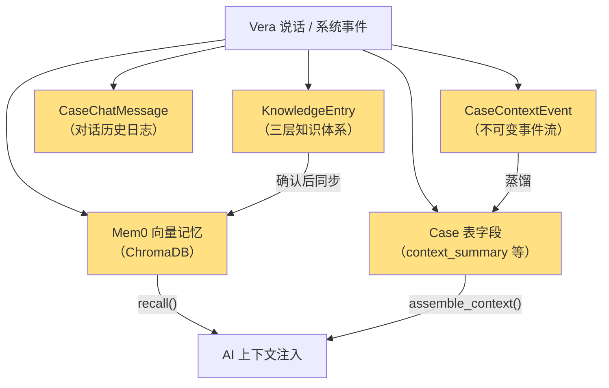
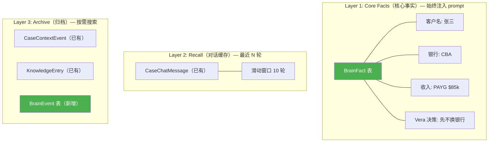

# CASE 大脑记忆系统 — 深度调研与设计方案

> 基于对现有代码库 6 个记忆相关模块的完整审计 + GitHub 4 大开源记忆框架的深度对比调研。

---

## 一、现有记忆系统：完整审计

### 1.1 当前的 5 层记忆存储

你的代码库中**已经有 5 个分散的记忆存储机制**，但它们之间缺乏统一协调：



| # | 存储 | 文件 | 写入方式 | 能力 | 缺陷 |
|---|------|------|---------|------|------|
| ① | **CaseContextEvent** | [accumulator.py](file:///D:/vera-workbench/core/context/accumulator.py) | 追加事件 → 触发蒸馏 | ✅ 不可变事件流、双轨（内/外线）、LLM 蒸馏 | ❌ 非结构化文本，无法查"收入是多少" |
| ② | **CaseChatMessage** | [orm.py L581-592](file:///D:/vera-workbench/core/models/orm.py#L581-L592) | 对话保存 | ✅ 完整对话历史 | ❌ 纯日志，不注入 prompt，不提取事实 |
| ③ | **KnowledgeEntry** | [orm.py L268-302](file:///D:/vera-workbench/core/models/orm.py#L268-L302) | 三层知识 CRUD | ✅ 案件/全局/行业三层、Vera 确认机制 | ❌ 不与对话联动，不自动从对话提取 |
| ④ | **Mem0 向量记忆** | [memory.py](file:///D:/vera-workbench/core/knowledge/memory.py) | remember() → ChromaDB | ✅ 语义搜索、脱敏后存储 | ❌ 外部依赖重、初始化可能失败、不可审计 |
| ⑤ | **Case 表字段** | [orm.py L24-87](file:///D:/vera-workbench/core/models/orm.py#L24-L87) | 直接写 ORM | ✅ 结构化（client_goal, context_summary 等） | ❌ 字段固定，无法扩展；无变更历史 |

### 1.2 现有系统的 5 个致命缺陷

> [!CAUTION]
> 以下缺陷意味着现有记忆系统**无法支撑大脑模式**。不是"改改就行"，需要一层新的记忆引擎。

| # | 缺陷 | 影响 | 根因 |
|---|------|------|------|
| **D1** | **没有结构化事实存储** | AI 无法回答"这个客户收入多少？" | CaseContextEvent 是非结构化文本 blob |
| **D2** | **不记得 Vera 说过什么** | 无法实现"你上次说想换 CBA" | 对话历史不注入 prompt，也不提取关键决策 |
| **D3** | **没有时间线上的事实变更追踪** | 无法知道"客户之前说自雇，后来改口说 PAYG" | 没有"同一事实的版本管理" |
| **D4** | **5 个存储互相隔离** | AI 上下文拼接碎片化，同一信息可能在 3 个地方各存一次 | 缺少统一的记忆编排层 |
| **D5** | **Mem0 依赖脆弱** | 启动时 ChromaDB 初始化失败 → 整个记忆层降级为 no-op | [memory.py L116-121](file:///D:/vera-workbench/core/knowledge/memory.py#L116-L121) 的 except 分支 |

---

## 二、GitHub 开源记忆框架：深度对比

### 2.1 四大项目概览

| 项目 | GitHub | Stars | 定位 | 核心存储 | 许可证 |
|------|--------|-------|------|---------|--------|
| **Mem0** | [mem0ai/mem0](https://github.com/mem0ai/mem0) | 25k+ | 用户个性化记忆层 | SQLite + Vector Store (Qdrant/Chroma) | Apache 2.0 |
| **Letta** | [letta-ai/letta](https://github.com/letta-ai/letta) | 15k+ | Agent 操作系统（记忆分级管理） | PostgreSQL + pgvector | Apache 2.0 |
| **Graphiti** | [getzep/graphiti](https://github.com/getzep/graphiti) | 6k+ | 时序知识图谱 | Neo4j / FalkorDB | MIT |
| **Cognee** | [topoteretes/cognee](https://github.com/topoteretes/cognee) | 4k+ | 知识图谱优先的记忆平台 | Relational + Vector + Graph | Apache 2.0 |

### 2.2 深度评估

---

#### Mem0 — 你的项目已经在用

**架构**：
```
对话消息 → LLM 提取 → 去重/合并 → 向量存储(ChromaDB/Qdrant) + 历史表(SQLite/Postgres)
```

**核心算法**（2026 版本重要进化）：
- **提取**：用 LLM 从对话中自动提取结构化记忆条目
- **合并**：新旧记忆对比，相同主题合并（"之前说 CBA，现在说 ANZ" → 更新为 ANZ）
- **矛盾检测**：发现前后矛盾时标记冲突
- **三级索引**：user_id（客户级）+ agent_id（全局经验）+ run_id（会话级）

**与 vera-workbench 的契合度**：

| 维度 | 评分 | 说明 |
|------|------|------|
| 功能匹配 | ⭐⭐⭐⭐ | 提取→存储→召回→合并的核心流程正好是大脑需要的 |
| 部署复杂度 | ⭐⭐ | ChromaDB 依赖重，初始化失败率高（你已经踩过坑） |
| PII 合规 | ⭐⭐⭐ | 可脱敏后存储（你已经做了） |
| 可控性 | ⭐⭐ | 记忆的"合并/去重"逻辑是 Mem0 内部 LLM 调用，不透明 |
| 与 SQLite 兼容 | ⭐⭐ | 历史表可用 SQLite，但向量检索需要额外服务 |

> [!IMPORTANT]
> **结论**：Mem0 的**算法思想**（提取→合并→矛盾检测）值得借鉴，但作为依赖项太重。你现在的 [memory.py](file:///D:/vera-workbench/core/knowledge/memory.py) 已经证明了这一点——初始化可能失败，降级为 no-op。大脑模式不能容忍"记忆层失灵"。

---

#### Letta (MemGPT) — 记忆分级思想最值得借鉴

**架构**（三层记忆分级）：
```
┌─────────────────────────────────────────────┐
│ Core Memory（核心记忆）— 始终在 prompt 中      │
│ · persona: AI 自己是谁                        │
│ · human: 用户是谁（结构化画像）                  │
│ · 自定义 Memory Blocks（可扩展）                │
├─────────────────────────────────────────────┤
│ Recall Memory（回忆记忆）— 对话历史缓存         │
│ · 最近 N 轮对话                               │
│ · Agent 自动决定何时"翻页"查旧对话              │
├─────────────────────────────────────────────┤
│ Archival Memory（档案记忆）— 长期冷存储          │
│ · 大量历史事实                                 │
│ · Agent 主动搜索（function calling）            │
│ · 类似数据库查询                               │
└─────────────────────────────────────────────┘
```

**核心能力**：
- **自编辑记忆**：Agent 通过 function calling 自行决定把什么写入 Core Memory
- **记忆块（Memory Blocks）**：结构化的 KV 存储，Agent 可以读写
- **上下文自管理**：Agent 自动判断什么该保留在"工作记忆"、什么该归档

**与 vera-workbench 的契合度**：

| 维度 | 评分 | 说明 |
|------|------|------|
| 功能匹配 | ⭐⭐⭐⭐⭐ | 三层分级 + 自编辑 + Memory Blocks 完美匹配大脑需求 |
| 部署复杂度 | ⭐ | 需要 PostgreSQL + pgvector，Server 模式，太重 |
| PII 合规 | ⭐⭐ | 没有内置脱敏，需要自己加 |
| 可控性 | ⭐⭐⭐ | Memory Blocks 可审计，但 Agent 自编辑可能"改乱" |
| 与 SQLite 兼容 | ⭐ | 核心依赖 PostgreSQL，不适合桌面应用 |

> [!TIP]
> **结论**：Letta 的**分级记忆思想**是最好的——Core（始终在 prompt 中）/ Recall（对话缓存）/ Archival（长期存储）。但不要用 Letta 本身（太重），而是**把这个分级思想移植到自建方案中**。

---

#### Graphiti (Zep) — 时序知识图谱

**架构**：
```
对话 → Episode → LLM 抽取实体和关系 → 写入图数据库
                                       ↓
                 每个边带 valid_from / valid_to（时序！）
                                       ↓
          查询时可以问"2026年7月这个客户的银行是什么"
```

**核心能力**：
- **双时态模型**：事件时间（什么时候发生的）vs 摄入时间（什么时候记录的）
- **事实失效**：新事实自动标记旧事实 `valid_to`（"客户换了银行"→ 旧银行关系失效）
- **关系图谱**：客户 → 银行、客户 → 收入类型、客户 → 房产 等关系网络

**与 vera-workbench 的契合度**：

| 维度 | 评分 | 说明 |
|------|------|------|
| 功能匹配 | ⭐⭐⭐ | 时序事实追踪很有价值，但关系图谱对单用户场景过度 |
| 部署复杂度 | ⭐ | 需要 Neo4j/FalkorDB，桌面应用完全不可行 |
| PII 合规 | ⭐⭐ | 无内置脱敏 |
| 可控性 | ⭐⭐⭐⭐ | 图谱可视化、关系可审计 |
| 与 SQLite 兼容 | ⭐ | 设计上依赖图数据库 |

> [!NOTE]
> **结论**：**时序事实追踪**（valid_from/valid_to）这个概念值得借鉴，但图数据库太重。可以用 SQLite 表 + 时间戳列来实现轻量版的"事实版本管理"。

---

#### Cognee — 知识图谱优先

**架构**：Extract → Cognify → Load（ECL 管道），三存储（关系 + 向量 + 图）。

**与 vera-workbench 的契合度**：和 Graphiti 类似，知识图谱方向，但依赖更多（LanceDB + 图数据库）。对桌面单用户场景过度设计。

---

### 2.3 对比总结

```
┌─────────────────────────────────────────────────────────┐
│                 我们需要什么？                              │
│                                                          │
│  ✅ 结构化事实存储（"客户收入 $85k PAYG"）                   │
│  ✅ 事实变更追踪（"之前说 CBA，现在改 ANZ"）                  │
│  ✅ 对话关键决策提取（"Vera 决定先不换银行"）                  │
│  ✅ 分级记忆注入（核心事实 always in prompt，细节按需搜索）     │
│  ✅ 纯 SQLite，无外部依赖                                   │
│  ✅ PII 脱敏合规                                           │
│  ✅ 与现有 CaseContextEvent/KnowledgeEntry 共存             │
│                                                          │
│  ❌ 不需要图数据库                                          │
│  ❌ 不需要复杂向量检索（案件数 < 100，SQLite LIKE 够用）       │
│  ❌ 不需要多用户/多 Agent                                   │
└─────────────────────────────────────────────────────────┘
```

---

## 三、推荐方案：自建轻量记忆引擎，借鉴 Mem0 算法 + Letta 分级思想

### 3.1 核心设计：三层记忆 + 两个新表



### 3.2 新增数据模型

#### BrainFact — 结构化事实（核心记忆）

借鉴 Mem0 的 "提取→合并→矛盾检测" + Graphiti 的 "valid_from/valid_to"：

```python
class BrainFact(Base):
    """案件结构化事实 — 大脑的核心记忆。
    
    每个事实是一个 key-value 对，带有版本管理。
    同一 key 可以有多个版本（事实变更追踪）。
    
    设计借鉴：
    - Mem0 的"记忆条目"：自动提取 + 合并 + 矛盾检测
    - Letta 的"Core Memory Block"：始终在 prompt 中
    - Graphiti 的"双时态"：valid_from / superseded_at
    """
    __tablename__ = "brain_facts"
    
    id = Column(String, primary_key=True)        # bf_{uuid}
    case_id = Column(String, nullable=False, index=True)
    
    # ── 事实内容 ──
    category = Column(String, nullable=False)     # "client_profile" | "loan_details" | 
                                                  # "income" | "decision" | "risk" | "preference"
    key = Column(String, nullable=False)           # "employment_type", "bank", "vera_decision"
    value = Column(Text, nullable=False)           # "PAYG, 年薪 $85,000"
    
    # ── 来源与置信度 ──
    source = Column(String, nullable=False)        # "vera_said" | "ai_extracted" | "system_detected"
    confidence = Column(String, default="high")    # "high" | "medium" | "low"
    source_message_id = Column(Integer, nullable=True)  # 来自哪条对话消息
    source_quote = Column(Text, nullable=True)     # Vera 原话摘录（"她说'客户是 PAYG'"）
    
    # ── 状态管理 ──
    status = Column(String, default="active")      # "active" | "superseded" | "revoked" | "pending"
    confirmed_by = Column(String, nullable=True)   # "vera" | "auto" (高置信自动确认)
    confirmed_at = Column(DateTime, nullable=True)
    
    # ── 版本管理（借鉴 Graphiti 时序模型）──
    version = Column(Integer, default=1)
    superseded_by = Column(String, nullable=True)  # 被哪个新事实取代
    superseded_at = Column(DateTime, nullable=True)
    supersede_reason = Column(Text, nullable=True) # "Vera 说改成 ANZ"
    
    # ── 时间戳 ──
    created_at = Column(DateTime, default=datetime.utcnow)
    updated_at = Column(DateTime, default=datetime.utcnow, onupdate=datetime.utcnow)
```

**核心设计决策**：
- **不做 UPDATE**——事实变更时，旧事实 status 改为 `superseded`，新事实 INSERT。这样有完整的变更历史。
- **category 枚举**（非 free-text）——保证 AI 提取的事实落到固定分类中，方便查询和注入。
- **source_quote**——保留 Vera 原话，AI 可以引用"你之前说过..."。

#### BrainEvent — 行为日志（归档记忆）

```python
class BrainEvent(Base):
    """大脑事件日志 — 记录 Vera 的每一个重要行为。
    
    与 CaseContextEvent 的区别：
    - CaseContextEvent 是"发生了什么"（系统事件）
    - BrainEvent 是"Vera 做了什么/说了什么"（用户行为 + AI 行为）
    
    用途：让 AI "记得" Vera 的操作模式和偏好。
    """
    __tablename__ = "brain_events"
    
    id = Column(Integer, primary_key=True, autoincrement=True)
    case_id = Column(String, nullable=True, index=True)  # None = 全局行为
    
    event_type = Column(String, nullable=False)
    # "vera_said"           — Vera 说了重要的话
    # "vera_decided"        — Vera 做了一个决策（确认/拒绝建议）
    # "vera_asked"          — Vera 问了一个问题
    # "vera_corrected"      — Vera 纠正了 AI
    # "ai_suggested"        — AI 给出了建议
    # "ai_remembered"       — AI 提取了一个事实
    # "fact_changed"        — 事实发生了变更
    # "fact_revoked"        — 事实被撤销
    
    content = Column(Text, nullable=False)         # 事件内容描述
    related_fact_id = Column(String, nullable=True) # 关联的 BrainFact ID
    session_message_id = Column(Integer, nullable=True) # 关联的对话消息 ID
    
    created_at = Column(DateTime, default=datetime.utcnow)
```

### 3.3 记忆注入管线（如何喂给 LLM）

这是最关键的设计——**什么时候把什么记忆喂给 AI**：

```python
def build_brain_prompt(case_id: str, db: Session) -> str:
    """构建大脑 prompt 的记忆注入部分。"""
    
    # ── Layer 1: Core Facts（始终注入，约 500-1000 chars）──
    active_facts = (
        db.query(BrainFact)
        .filter(BrainFact.case_id == case_id, BrainFact.status == "active")
        .order_by(BrainFact.category, BrainFact.updated_at.desc())
        .all()
    )
    
    facts_by_category = {}
    for f in active_facts:
        facts_by_category.setdefault(f.category, []).append(f)
    
    core_memory = "## 你对这个客户的记忆\n"
    for cat, facts in facts_by_category.items():
        core_memory += f"\n### {cat}\n"
        for f in facts:
            source_tag = "✅" if f.confirmed_by == "vera" else "🤖"
            core_memory += f"- {source_tag} {f.key}: {f.value}\n"
    
    # ── Layer 1b: Vera 的决策和偏好（始终注入）──
    decisions = (
        db.query(BrainEvent)
        .filter(
            BrainEvent.case_id == case_id,
            BrainEvent.event_type.in_(["vera_decided", "vera_corrected"]),
        )
        .order_by(BrainEvent.created_at.desc())
        .limit(5)
        .all()
    )
    
    if decisions:
        core_memory += "\n### Vera 的决策\n"
        for d in decisions:
            core_memory += f"- {d.content}\n"
    
    # ── Layer 2: Recall（对话历史，由对话引擎单独处理）──
    # 滑动窗口 10 轮，在 BrainEngine 中注入 messages 数组
    
    # ── Layer 3: Archive（按需，通过 function calling 搜索）──
    # query_memory 工具让 AI 自己决定何时搜索归档记忆
    
    return core_memory
```

### 3.4 事实提取算法（借鉴 Mem0 核心算法）

```python
# 借鉴 Mem0 的 memory_processor 算法，简化为我们的版本

EXTRACTION_PROMPT = """从以下对话中提取结构化事实。

已知事实：
{existing_facts}

新对话：
{conversation}

请提取新的事实或需要更新的事实。对于每个事实，输出 JSON：
{{
  "action": "ADD" | "UPDATE" | "DELETE",
  "category": "client_profile" | "loan_details" | "income" | "decision" | "risk" | "preference",
  "key": "字段名",
  "value": "字段值",
  "confidence": "high" | "medium" | "low",
  "quote": "Vera 的原话（如果有）",
  "reason": "为什么提取/更新这个事实"
}}

规则：
1. 只提取明确的事实，不推测
2. 如果 Vera 纠正了之前的信息，标记为 UPDATE
3. 如果 Vera 说"不对/记错了"，标记为 DELETE
4. Vera 的决策（"我决定..."、"先不..."、"就用..."）归类为 decision
5. Vera 的问题也是重要信号（"CBA 的利率是多少？"→ 说明她在考虑 CBA）
"""
```

### 3.5 与现有代码的对接方案

```
┌─────────────────── 新增记忆引擎 ───────────────────┐
│                                                      │
│  BrainFact (新表)  ←── 提取自对话 ──→ BrainEvent (新表) │
│       │                                    │          │
│       ├── 确认后 ──→ CaseContextEvent (已有) │          │
│       │              (trigger_distill)       │          │
│       │                                    │          │
│       └── 同步到 ──→ Case 表字段 (已有)                │
│              (client_goal, lender 等)                  │
│                                                      │
│  CaseChatMessage (已有) ←── 滑动窗口 ──→ LLM prompt   │
│                                                      │
│  KnowledgeEntry (已有) ←── 保持不变 ──→ 全局经验/政策   │
│                                                      │
│  Mem0 (已有) ←── 降级为可选增强 ──→ 向量搜索兜底        │
│              (不再是核心依赖)                            │
└──────────────────────────────────────────────────────┘
```

**关键对接点**：

| 现有模块 | 改动 | 说明 |
|---------|------|------|
| [accumulator.py](file:///D:/vera-workbench/core/context/accumulator.py) | 保留不变 | BrainFact 确认后自动调用 `append_context_event` |
| [context_builder.py](file:///D:/vera-workbench/core/ai/context_builder.py) | **改造** | `_build_case_brain()` 从读 Case 字段改为读 BrainFact 表 |
| [case_context.py](file:///D:/vera-workbench/core/ai/case_context.py) | **改造** | `build_case_context()` 新增 `facts` 字段 |
| [knowledge_base.py](file:///D:/vera-workbench/core/ai/knowledge_base.py) | 保留不变 | 文件级知识库（build_knowledge）继续独立工作 |
| [memory.py](file:///D:/vera-workbench/core/knowledge/memory.py) | **降级** | Mem0 从核心依赖变为可选增强，BrainFact 是主记忆 |
| [recall.py](file:///D:/vera-workbench/core/knowledge/recall.py) | **改造** | recall_for_context 先查 BrainFact，再 fallback 到 Mem0 |

---

## 四、Category 枚举设计（贷款行业专属）

```python
FACT_CATEGORIES = {
    # 客户画像
    "client_profile": [
        "client_name", "employment_type", "residency", "visa_type",
        "marital_status", "dependents", "preferred_language", "age",
    ],
    # 贷款详情
    "loan_details": [
        "bank", "loan_amount", "property_value", "lvr", "purpose",
        "interest_rate", "loan_term", "product_type", "offset_account",
    ],
    # 收入
    "income": [
        "income_type", "annual_income", "employer", "abn_years",
        "rental_income", "other_income", "income_evidence",
    ],
    # 负债
    "liability": [
        "existing_mortgage", "credit_card_limit", "car_loan",
        "hecs_debt", "other_liability",
    ],
    # 首付与资产
    "deposit": [
        "deposit_source", "deposit_amount", "savings_history",
        "gift_letter", "property_sale",
    ],
    # Vera 的决策
    "decision": [
        "bank_choice_reason", "strategy", "next_step", "hold_reason",
        "risk_acceptance", "timeline_decision",
    ],
    # 风险
    "risk": [
        "probation_period", "abn_insufficient", "low_deposit",
        "high_lvr", "credit_issue", "visa_risk",
    ],
    # 偏好
    "preference": [
        "communication_style", "response_urgency", "follow_up_preference",
    ],
}
```

---

## 五、不引入外部框架的理由

| 因素 | Mem0/Letta/Graphiti | 自建方案 |
|------|-------------------|---------|
| **依赖复杂度** | ChromaDB/PostgreSQL/Neo4j | 纯 SQLite，零外部依赖 |
| **部署方式** | Docker / Server | 桌面应用内嵌 |
| **PII 合规** | 需要额外加脱敏层 | 直接复用已有 desensitize/rehydrate |
| **可控性** | 记忆合并/去重是黑盒 | 每一步都可审计、可回滚 |
| **与现有代码兼容** | 需要适配层 | 直接对接已有 ORM/accumulator |
| **案件规模** | 为百万级用户设计 | < 100 案件，SQLite 足够 |
| **学习成本** | 新框架 API | 复用已有 SQLAlchemy 模式 |

> [!IMPORTANT]
> **推荐策略**：不引入任何外部记忆框架。借鉴 **Mem0 的提取→合并→矛盾检测算法** + **Letta 的三层记忆分级思想** + **Graphiti 的时序事实版本管理**，在纯 SQLite 上自建轻量记忆引擎。

---

## 六、待决策点

| # | 决策 | 建议 | 理由 |
|---|------|------|------|
| 1 | BrainFact 是独立新表还是复用 CaseContextEvent？ | **独立新表** | 职责不同：结构化 KV 对 vs 非结构化事件流 |
| 2 | 事实提取用 function calling 还是后处理？ | **两者结合**：AI 通过 save_fact 工具主动记录 + 每轮对话后后处理补漏 | 避免遗漏 |
| 3 | Mem0 是否完全移除？ | **降级为可选**：可用则用，不可用则纯 BrainFact | 渐进过渡 |
| 4 | BrainFact 是否需要向量搜索？ | **Phase 1 不需要**，< 100 案件用 category + key 查询足够 | 避免过度设计 |
| 5 | 事实确认策略？ | **高置信自动确认 + 低置信反问** | 同大脑构想 |
| 6 | BrainFact 确认后是否同步写回 Case 表字段？ | **是**——bank→Case.lender, income→Case.employment_type 等 | 保持现有全景/统计正常工作 |
| 7 | BrainEvent 是否长期保留？ | **是**——不自动清理，作为审计日志 | Vera 可以回溯任何决策 |
| 8 | 全局偏好记忆（跨案件）如何处理？ | **case_id=None 的 BrainFact**（"Vera 喜欢 CBA"）| 复用同一张表 |
| 9 | 是否需要 "遗忘" 机制？ | **Phase 1 不做**；未来可加"N 天不活跃的事实降低注入优先级" | 先做完整记忆，再优化裁剪 |
