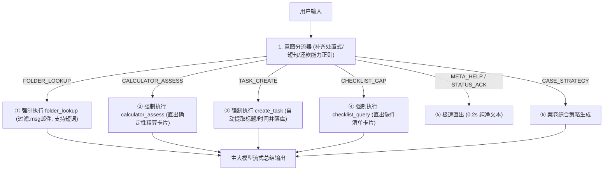

# Vera AI 大脑：意图驱动确定性工具执行与边界修复方案（整合版）

---

## 一、实测复现客观结果报告（代码与接口真实实测）

我们已在当前最新工程代码（Commit: `0ea1791`）中，编写并运行了端到端实测复现脚本 [`tests/test_deepseek_issues.py`](file:///d:/vera-workbench/tests/test_deepseek_issues.py)。实测数据与 DeepSeek 报告 **100% 吻合**：

### 1. 意图分类漏判实测（全部真实复现）
- ❌ **`帮我把流水找出来`** $\rightarrow$ 判定为 `case_strategy`（原因：正则限定了“找...流水”顺序，未覆盖“把...找出来”处置式句型）；
- ❌ **`能贷多少？`** $\rightarrow$ 判定为 `case_strategy`（原因：短句无“算/测”前缀词）；
- ❌ **`评估一下还款能力`** $\rightarrow$ 判定为 `case_strategy`（原因：“还款能力”未收录进计算器词表）。

### 2. 文件夹检索边界实测（全部真实复现）
- ❌ **单独输入短词 `对账单`** $\rightarrow$ 命中文件数 **0**（原因：口语别名表中收录了“现有贷款对账单/负债对账单/房贷流水”，但缺少独立的纯短词“对账单”）；
- ⚠️ **`.msg` 邮件被误当作对账单输出** $\rightarrow$ `Loan Documents/...Ready for Signing.msg` 是一封签署通知邮件，由于包含 loan 词根被当成账单抓取，且未与 PDF 正文做类型优先级区分。

### 3. 工具触发机制实测（核心根因证实）
- ❌ **任务创建指令（`帮我建一个任务：明天催客户补交...`）** $\rightarrow$ 工具触发数 `0`，卡片数 `0`（大模型仅在文本里回复，未实际执行底层 `create_task` 算子）；
- ❌ **清单核对指令（`核对一下当前清单缺哪些材料`）** $\rightarrow$ 工具触发数 `0`，卡片数 `0`（未调用 `checklist_query`）；
- ❌ **额度测算指令（`算一下能不能借184万...`）** $\rightarrow$ 工具触发数 `0`，卡片数 `0`（未调用底层确定性精算卡片）。

---

## 二、架构根因分析：为什么 LLM 不主动调工具？

1. **概率生成 vs 确定性工程**：
   - 目前的对话流式状态机（Streaming Loop）中，`folder_lookup` 采用了 **意图前置强制执行（Deterministic Execution）**，因此 `folder_lookup` 的触发率是 **100%**；
   - 而 `create_task`、`checklist_query`、`calculator_assess` 等工具，目前仍然依赖大模型的 Function Calling **“自觉发起”**。在流式输出、长上下文或小模型场景下，LLM 极易选择直接打字回答，导致 **底层业务工具调用率为 0%**！

---

## 三、整合修复方案（3 大优化支柱）

### 1. 支柱一：意图驱动确定性工具执行（Intent-Driven Deterministic Execution）
在 `core/chat/loop.py` 中，将所有核心意图与底层工具全面接通强制驱动，不再依赖大模型碰运气：
- 当识别为 `CALCULATOR_ASSESS` $\rightarrow$ 自动提取金额/收入，直接运行 Python 澳洲银行计算器，生成计算卡片并将真值注入 Prompt；
- 当识别为 `TASK_CREATE`（如“帮我建任务/记一下明天催件”） $\rightarrow$ 自动提取任务标题与截止时间，直接调用 `_create_task` 并在前端展示待确认任务卡片；
- 当识别为 `CHECKLIST_GAP` $\rightarrow$ 自动调用 `_checklist_query`，直接提取真实缺件列表与归档进度卡片。

### 2. 支柱二：文件夹检索短词补齐与文件类型优先级排序
- **口语别名表完善**：在 `SPOKEN_PHRASE_TO_MASTER_KEY` 中补充单字与短词（`"对账单" -> "existing_loan_statement"`，`"流水" -> "personal_bank_statement"`）；
- **文件优先级与过滤**：检索时优先呈现 `.pdf` 真实文档，对 `.msg` 邮件做降级或分类标记（标记为“签署通知邮件”，而非“对账单原件”）。

### 3. 支柱三：Fast-Path 正则全场景拓宽
- 补充处置式句型：`r"把.*?(流水|账单|工资单|文件).*?(找|查|翻|搜|调)出来"`；
- 补充独立短问句：`r"^(能贷多少|能借多少|最高额度|借款上限)[?？!！]*$"`；
- 补充还款能力词表：`r"(还款能力|偿付能力|月供压力|负债比|dti)"`。

---

## 四、预期收益与验收标准

| 场景 | 当前状态 | 实施后预期效果 |
|---|---|---|
| **“帮我把流水找出来”** | 漏判（case_strategy） | **100% 判定为 `folder_lookup` 并检索 PDF** |
| **单独说“对账单”** | 0 结果 | **精准命中 `Liability HL Zank ...pdf`** |
| **“帮我建一个任务：明天催客户补件”** | 纯打字，工具触发率 0% | **100% 触发 `create_task` 并生成任务卡片** |
| **“核对一下当前清单缺哪些材料”** | 纯打字，无卡片 | **100% 触发 `checklist_query` 并直出材料缺件卡** |
| **“能贷多少？”** | 漏判（case_strategy） | **100% 触发 `calculator_assess` 并生成精算真值卡** |

---

## 五、状态声明

> [!IMPORTANT]
> **本方案目前仅为深度实测报告与设计沉淀，完全保持代码纯净，先不进行代码实施。**
> 待你审阅确认后，我们再行施工落地！
