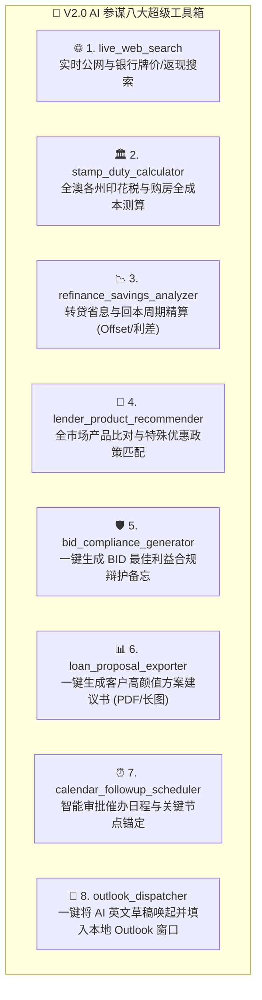

# WO-63: Vera Workbench V2.0 AI 超级军师工具箱与全景演进规范

> **文档版本**: v2.0-Draft  
> **编制日期**: 2026-08-20  
> **核心定位**: 为高级信贷经纪人 Vera 打造涵盖“实时情报 ➔ 方案精算 ➔ 选行匹配 ➔ BID合规 ➔ 办公直连”的 5 维全能 AI 参谋体系。

---

## 一、战略背景与定位演进

在 **V1.0** 阶段，系统成功落地并筑牢了以下 4 大核心基石：
1. **信贷案卷全生命周期拓扑建档**（新建客户、在途导入、历史归档）；
2. **三档渐进材料清单与本地文件自动对齐**（画像推荐 ➔ 自动对齐打勾 ➔ 双语催件清单直出）；
3. **多维时序证据链**（邮件时序 + 经办人沟通手记 + 阶段流转 + 估价里程碑，杜绝外部下载，就地原生预览）；
4. **多银行服务能力测算**（CBA / Macquarie / BOC / MA Money / LaTrobe / Resimac 确定性测算）。

进入 **V2.0**，AI 参谋将从“案卷助手”跨越至**“全知全能的信贷合伙人”**，通过统一工具协议（Tool-Calling Protocol）挂载 **8 款杀手级工具**。

---

## 二、V2.0 AI 超级工具箱（Super Toolset）全景架构

---

## 三、八大工具详细规格与功能定义

### 维度一：外部情报与实时政策类

#### 1. `live_web_search`（实时公网与银行政策检索）
* **功能描述**：通过接入安全高速的搜索网关，赋予 AI 实时感知外部金融动态的能力。
* **参数契约**：
  * `query`: string（检索意图，如 `"CBA latest owner occupied variable rate and cashback August 2026"`）
  * `scope`: `"rates"` | `"policy"` | `"property"` | `"general"`
* **实战场景**：
  * 查各大银行本周最新的降息/加息动态与促销 Cashback；
  * 查询各州政府首次置业补贴政策或印花税阶梯变动；
  * 查特定区域近期房产中位成交价与租金收益率。

---

### 维度二：客户财务与成本精算类

#### 2. `stamp_duty_calculator`（全澳各州印花税与置业全成本计算器）
* **功能描述**：精准测算客户在买房时需要准备的每一分前期现金。
* **参数契约**：
  * `state`: `"NSW"` | `"VIC"` | `"QLD"` | `"SA"` | `"WA"` | `"ACT"` | `"TAS"` | `"NT"`
  * `property_value`: float
  * `is_first_home`: boolean
  * `is_foreign_buyer`: boolean（海外买家附加税）
  * `purpose`: `"OO"` (自住) | `"INV"` (投资)
* **输出数据**：
  * 政府印花税金额（Stamp Duty）
  * 首次置业豁免/减免金额（Concession）
  * 海外买家附加税（Surcharge）
  * 过户及抵押登记费（Registration Fees）
  * **借款人所需自备现金总额（Total Cash Required）**

#### 3. `refinance_savings_analyzer`（转贷省息与回本周期精算器）
* **功能描述**：为转贷（Refinance）客户量身定制经济效益对比。
* **参数契约**：
  * `current_loan_amount`: float
  * `current_rate`: float（原银行利率）
  * `new_rate`: float（目标银行利率）
  * `cashback_amount`: float（目标银行返现，默认 0）
  * `discharge_costs`: float（解约与交割成本，默认 $350~$700）
  * `offset_balance`: float（对冲账户预计常驻资金）
* **输出数据**：
  * 月度供款差额（Monthly Savings）
  * 年化利息节省总额（Annual Interest Saved）
  * **转贷成本回本周期（Payback Period in Months）**
  * 5 年期累计净收益（5-Year Net Benefit）

---

### 维度三：智能选行与合规护城河类

#### 4. `lender_product_recommender`（全市场特殊政策智能匹配器）
* **功能描述**：根据借款人特殊职业与资产画像，筛选最宽松、最匹配的放款机构。
* **匹配维度**：
  * **免 LMI 职业政策**（医生/牙医/会计师/律师/工程师等 85%~90% 无 LMI 贷款）；
  * **非标准收入认可比例**（加班费 100% 认定、奖金折算比、海外收入认可行、自雇单年 Tax Return 政策行）；
  * **商业物业/大额贷款 LVR 政策**。

#### 5. `bid_compliance_generator`（BID 最佳利益合规辩护备忘生成器）
* **功能描述**：全自动满足 ASIC 监管要求下的 Best Interests Duty（BID）合规审查。
* **生成内容**：
  * 客户核心优先诉求确认（如：追求额度最大化 / 追求最低浮动利息 / 需要多对冲账户分账）；
  * 为何所选推荐银行最符合客户利益的法律与业务依据；
  * 为何放弃备选银行的合理合规解释（如：备选行利息低 0.05% 但借款能力不足无法达成置业目标）。

---

### 四、交付呈现与办公协同类

#### 6. `loan_proposal_exporter`（高颜值客户方案建议书一键导出）
* **功能描述**：将测算结果、银行对比、月供明细与材料清单一键转化为专业美观的方案书。
* **输出形式**：
  * 📱 **微信图文长卡片**（手机端舒适阅读）；
  * 📑 **商业级 PDF 方案书**（带团队品牌 Logo、经纪人执照编号、还款阶段拆解图表）。

#### 7. `calendar_followup_scheduler`（智能审批催办日程与关键节点锚定）
* **功能描述**：自动计算信贷关键推进节点并注入日程看板。
* **自动化触发**：
  * 递交后第 3 个工作日：催分配审贷经理（Assessor）；
  * 紧贴 Finance Clause 前 48 小时：发起紧急批复催收；
  * 预定 Settlement 前 5 个工作日：与过户律师对齐资金缺口与放款指令。

#### 8. `outlook_dispatcher`（本地 Outlook 邮件撰写窗口直调）
* **功能描述**：打通桌面操作系统协议，实现一键外发。
* **实操体验**：
  * 点击 `[ 🚀 打开 Outlook ]`；
  * 本地 Outlook 瞬间弹出新邮件窗口，自动填好发件人、收件审批官邮箱、标准主题与格式化正文，经纪人确认无误即可一键发送。

---

## 四、实施演进路线图（V2.0 Roadmap）

| 阶段 | 交付核心 | 预计实现重点 |
| :--- | :--- | :--- |
| **Phase 2.1** | **外部情报与实时政策** | 挂载 `live_web_search`；支持在 AI 对话中一键查询公网最新利率与各州补贴政策。 |
| **Phase 2.2** | **客户财务与成本精算** | 落地 `stamp_duty_calculator` 与 `refinance_savings_analyzer`，打通全澳各州印花税与转贷省息精算。 |
| **Phase 2.3** | **BID 合规与方案呈现** | 落地 `bid_compliance_generator` 与 `loan_proposal_exporter`，支持一键导出客户方案书与合规留痕备忘。 |
| **Phase 2.4** | **桌面协同与通讯直连** | 落地 `outlook_dispatcher` 与 `calendar_followup_scheduler`，实现本地 Outlook 邮件与审批催办日程一键联动。 |

---

## 五、结论与原则

1. **隐私安全底线（Red Line #1）**：调用外部公网搜索工具时，严禁携带客户真实姓名、电话、税号等任何 PII 隐私信息；
2. **决策权归属经纪人（Red Line #2）**：AI 提供多维度精准方案与草稿，所有外发动作均需 Vera 明确确认后触发；
3. **数据资产同源（Single Source of Truth）**：所有工具测算产生的结论与数字，实时沉淀入案卷大脑 `Brain Facts`，实现全生命周期无缝流转。
