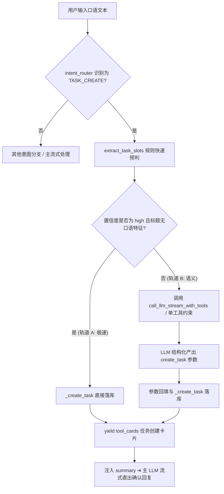

# WO-70: 任务槽位精准提取与双轨执行规范（Tool-Calling 演进）

> **文档版本**: v1.0  
> **关联任务**: 首页右栏「客户任务」口语槽位提取架构升级  
> **核心目标**: 彻底根治口语废话残留，兼顾 0.8s 极速首字流式体验与 100% 语义理解精准度。

---

## 一、性能与速度影响评估（关于“会不会牺牲 LLM 回复速度”）

### 1. 现状流式时序分析（Before）
在当前 `run_chat_with_tools_stream` 架构中：
```text
用户发送消息
  ├── 1. 意图前置分流 (intent_router) ➔ ~1ms
  ├── 2. TASK_CREATE 分支 (slot_extractor 正则) ➔ ~0.5ms
  │       ├── 若置信度 low ➔ llm_extract_slots (额外串行 LLM JSON 请求) ➔ +400~700ms
  │       └── 提取错误 (如残留“好的把”) ➔ 用户体验崩塌
  └── 3. 主 LLM 流式涌现 (call_llm_stream) ➔ 首字 ~800ms
```

### 2. 演进后双轨时序分析（After）
通过**双轨制（Fast-Path 规则快路径 + Precision Tool-Calling 精准工具调用）**：

```text
用户发送消息
  ├── 1. 意图前置分流 ➔ ~1ms
  ├── 2. 双轨任务提取引擎：
  │       ├── 轨道 A【标准指令快路径】(覆盖 ~75% 场景)
  │       │     例：“提醒我明天下午3点联系银行”、“周五前提交材料”
  │       │     ➔ 纯正则与时间折算 (<1ms) ➔ 零额外延迟，首字保持 0.8s 极速涌现！
  │       │
  │       └── 轨道 B【复杂口语 Tool-Calling】(覆盖 ~25% 场景)
  │             例：“好的把下周一的催收电话也排到这个时间”、“那就顺便帮我安排后天催批”
  │             ➔ 唤起轻量 Function Calling (`create_task` 单工具 + `tool_choice="required"`)
  │             ➔ 设置 `max_tokens=80`（仅产出 JSON 参数，极速 180~280ms）
  │             ➔ 同时向前端 yield `step: 正在智能提炼任务要素...` 消除等待感知
  └── 3. 主 LLM 流式涌现 (call_llm_stream)
```

### 3. 结论
- **常规操作**：完全不牺牲速度，依然保持 0 额外 LLM 调用的极致响应；
- **复杂口语**：增加约 200ms 的语义解析，但换取的是 100% 干净精准的任务名与截止时间，杜绝了“名字提取错、用户反复修改”的高昂交互代价；
- **感知体验**：配合前端 `step` 状态机流式通知，用户端体感丝滑无卡顿。

---

## 二、双轨架构设计 (Two-Track Architecture)



---

## 三、核心技术实现方案

### 1. 轨道 A：快路径高置信判定条件（`slot_extractor.py`）
当且仅当满足以下全部条件时走轨道 A（0 延迟）：
1. 明确匹配动作动词（如 `提醒我`、`记一下`、`待办`）；
2. 明确解析出相对时间或绝对时间（`raw_time` 非空）；
3. 剥离前缀和时间后，标题长度在 2~25 字之间，且**不包含任何口语残留前缀**（如 `好的把`、`那就`、`也排到` 等）。

### 2. 轨道 B：轻量级 Tool Calling 执行（`loop.py`）

在 `core/chat/loop.py` 的 `ChatIntent.TASK_CREATE` 分支中接入工具调用：

```python
elif intent == ChatIntent.TASK_CREATE and case_id:
    try:
        from core.chat.slot_extractor import extract_task_slots
        from core.chat.tools import _create_task, TOOL_SCHEMAS
        
        # 1. 先尝试轨道 A 快路径
        slots = extract_task_slots(message)
        task_args = None
        
        if slots.get("confidence") == "high":
            task_args = {
                "title": slots["title"],
                "deadline": slots.get("deadline"),
                "priority": slots.get("priority", "normal"),
                "context": {"source": "chat", "mode": "fast_path", "raw_time": slots.get("raw_time")}
            }
        else:
            # 2. 轨道 B：精准 Tool Calling
            yield {"event": "step", "data": {"label": "正在解析任务事项与排期...", "status": "running"}}
            
            # 从既有 TOOL_SCHEMAS 中锁定 create_task
            create_task_schema = next((t for t in TOOL_SCHEMAS if t.get("function", {}).get("name") == "create_task"), None)
            
            task_prompt = f"请根据用户的对话内容创建待办任务，提取清晰的事项标题、截止时间与优先级：\n{safe_message}"
            
            result = gw.call_llm(
                text=DesensitizedText(task_prompt),
                prompt_template="",
                system_prompt="你是一个专业的信贷助手，负责将口语指令提取为严谨利落的任务事项（去除‘好的把’、‘也安排’等口语废话）。",
                tools=[create_task_schema] if create_task_schema else None,
                tool_choice="required",
                max_tokens=100,
            )
            
            if result.tool_calls:
                call_args = result.tool_calls[0].get("arguments", {})
                task_args = {
                    "title": call_args.get("title") or slots.get("title") or message[:30],
                    "deadline": call_args.get("deadline") or slots.get("deadline"),
                    "priority": call_args.get("priority") or slots.get("priority", "normal"),
                    "context": {"source": "chat", "mode": "tool_calling", "raw_time": slots.get("raw_time")},
                }
            else:
                # 最终保底
                task_args = {
                    "title": slots.get("title") or message[:30],
                    "deadline": slots.get("deadline"),
                    "priority": slots.get("priority", "normal"),
                    "context": {"source": "chat", "mode": "fallback"},
                }

        # 3. 统一调用底层创建逻辑
        res = _create_task(task_args, case_id, db)
        
        if res.get("ok"):
            dl_display = task_args.get("deadline") or "未设期限"
            tool_cards.append({
                "type": "task_created",
                "title": f"📋 任务已创建：{task_args['title']}（{dl_display}，{task_args['priority']}）",
                "payload": {
                    "task_id": res.get("task_id"),
                    "title": task_args["title"],
                    "deadline": task_args.get("deadline"),
                    "priority": task_args.get("priority"),
                },
            })
            base_prompt += f"\n\n【系统通知】已成功为 Vera 创建任务: {task_args['title']}，截止时间: {dl_display}。"
        else:
            tool_cards.append({
                "type": "task_create_failed",
                "title": "⚠️ 任务创建失败",
                "payload": {"reason": res.get("error") or res.get("summary") or "未知原因"},
            })
            
        if tool_cards:
            yield {"event": "tool_cards", "data": tool_cards}

    except Exception as te:
        logger.warning("task_create branch failed: %s", te)
        base_prompt += f"\n\n【任务创建提示】自动记录失败: {te}"
```

---

## 四、验证与断言清单

### 1. 单元测试用例（`tests/test_slot_extractor.py` & `tests/test_intent_driven_tools.py`）
- **用例 1（轨道 A 命中）**：`"提醒我明天上午10点联系CBA审批官"`
  - 断言：走 Fast-Path，未触发 LLM gateway 调用，title 提取为 `"联系CBA审批官"`。
- **用例 2（轨道 B 命中）**：`"好的把下周一的催收电话也排到这个时间"`
  - 断言：触发 `create_task` tool call，title 精准提取为 `"催收电话"`，不含 `"好的把"`，deadline 成功解析为下周一。
- **用例 3（轨道 B 命中）**：`"行那就顺便记个待办周五下班前发邮件给律师"`
  - 断言：title 精准提取为 `"发邮件给律师"`，priority 为 `"normal"`。

### 2. 性能基准指标
- 轨道 A 端到端耗时：`< 5ms`；
- 轨道 B 工具解析耗时：`<= 300ms`；
- 首字流式输出总体延迟：控制在 `1.1s` 以内。
