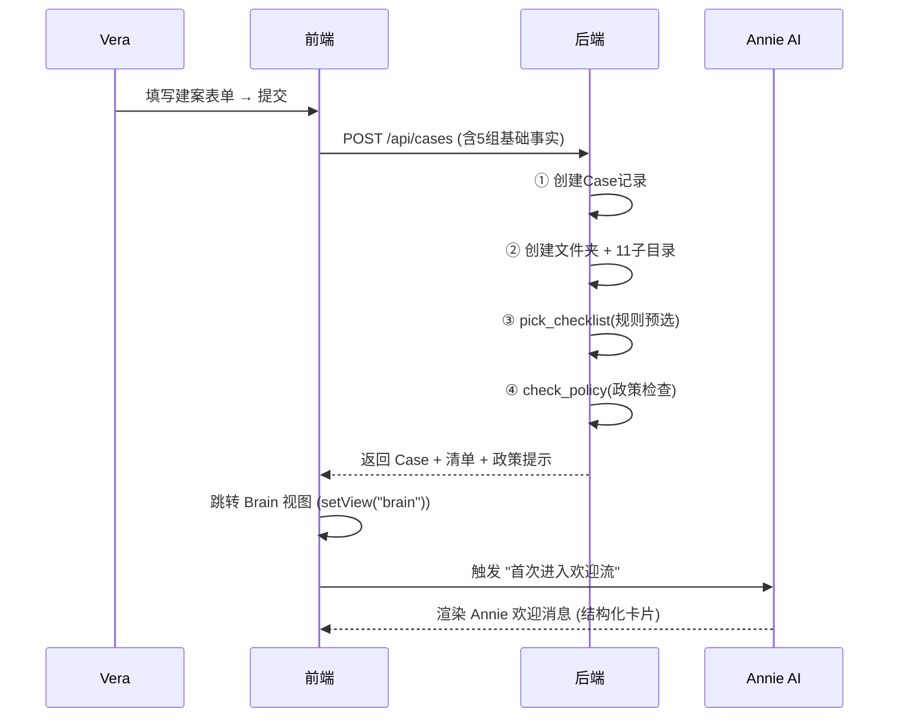

# 问题二：新建客户首次进入 — AI 协同体验设计

> **阶段**：头脑风暴 & 方案推演（五步门禁第 2 步）  
> **关联**：AGENTS.md §2.0 产品理念「她说、它记、它答、它建议、她拍板」

---

## 一、调研发现：Vera 真实工作流 vs 系统现状

### 1.1 Vera 的真实清单邮件（截图还原）

Vera 在新建客户后发送的 **Preliminary Assessment** 邮件包含 **7 大板块**：

| # | 板块 | 内容类型 | 具体项目 |
|---|------|---------|---------|
| 1 | **ID** | 文档 | Driver Licence(正反面)、Passport、VISA(非澳公民)、Mobile number |
| 2 | **Income** | 文档+信息 | 2 期工资单、6 月银行流水(工资入账)、公司财报(2年)、公司税表(2年)、个人税表(2年)、NOA(2年)、ATO Income Statement、投资物业租金证明 |
| 2b | **Employment History** | 结构化信息 | 最近 3 年雇主历史：公司名、职位、地址、电话、起止日期 |
| 3 | **Living Expense** | 文档 | 6 月主账户流水(生活开支) |
| 4 | **Liability** | 文档 | 6 月房贷对账单、60天内信用卡账单(含 6 月历史)、6 月车贷/个贷对账单 |
| 5 | **Living History** | 结构化信息 | 最近 3 年居住历史：地址 + 起止日期 |
| 6 | **Asset** | 文档+信息 | Trust Deed、Council Rates、购房合同、首付收据、存款余额证明、车辆资产(品牌型号价值)、Super |
| 7 | **Solicitor Info** | 纯信息 | 律师事务所名、联系人、邮箱、电话 |

### 1.2 系统现状对照

#### ✅ 已覆盖（checklist_master.yaml 中存在）
- 护照、驾照、VISA、Medicare
- 工资单(2期)、雇佣信、税表(1-2年)、会计师信、BAS
- 银行流水、房贷对账单、信用卡账单
- 购房合同、Council Rates、估价报告、租约、房屋保险
- 赠予信、信托文件、SMSF

#### ❌ 关键缺口（Vera 实际发送但系统没有的）

| 缺口 | 类型 | 重要度 | 说明 |
|------|------|--------|------|
| ATO Income Statement | 文档 | 🔴 高 | 澳洲税务局收入声明，自雇/PAYG 常用 |
| 6 月工资入账流水 | 文档(含标注) | 🔴 高 | 与"生活开支流水"分开要求，但现有 `personal_bank_statement` 未区分用途 |
| 车贷/个贷对账单 | 文档 | 🟡 中 | 现有仅 `existing_loan_statement`(笼统) |
| 首付收据(Deposit Receipt) | 文档 | 🟡 中 | 购房场景必需 |
| 存款余额证明(Savings Proof) | 文档 | 🟡 中 | 证明真储蓄 |
| 3 年雇主历史 | **结构化信息** | 🔴 高 | 非文档，需要结构化表单 |
| 3 年居住历史 | **结构化信息** | 🔴 高 | 非文档，需要结构化表单 |
| 律师信息 | **结构化信息** | 🟡 中 | 联系方式，非文档 |
| 车辆资产信息 | **结构化信息** | 🟢 低 | 品牌/型号/价值，非文档 |
| Super余额 | **文档/信息** | 🟢 低 | 养老金余额证明 |

> [!IMPORTANT]
> **核心发现**：Vera 的清单有两类本质不同的项目：
> 1. **文档收集项**（上传 PDF/图片） — 系统已有 checklist 机制处理
> 2. **信息采集项**（填写结构化数据：雇主历史、居住历史、律师信息） — 系统**完全没有**对应机制
> 
> 这意味着 Annie 的"首次进入体验"不能只是弹个清单，还需要引导 Vera 填写关键的结构化信息。

---

## 二、同业竞品调研

| 产品 | 新客首次体验 | 关键设计 |
|------|-------------|---------|
| **MyCRM (Loan Market)** | Hello Pack → 自动发 Fact Find + 文档请求 | AI 预判所需材料；MyQualityAssurance 做 500+ 数据点预检 |
| **Salestrekker** | 条件化工作流自动触发 | 按贷款类型动态生成 checklist + 自动催件 |
| **FileInvite** | 模板化文档请求门户 | 多方追踪、自动提醒、品牌化客户门户 |
| **最佳实践共识** | "4 分钟窗口" | 建案后立即触发：感谢邮件 + 文档清单 + Broker 任务 |

---

## 三、方案设计：Annie 首次进入协同体验

### 3.0 设计原则

```
① 零空白：新建后立即有内容，不让 Vera 面对空白聊天框
② 对话优先：信息呈现在对话流中，不是弹窗或单独页面
③ 主动但不越权：Annie 生成建议，Vera 一键确认或调整
④ 闭环：每个建议项都可确认 / 修改 / 跳过 / 稍后
⑤ 渐进式：先做最核心的，V1 可行 → V2 丰满
```

### 3.1 完整流程（从建案到首次进入）



### 3.2 Annie 欢迎消息设计（核心交互）

新建案件后，Vera 进入 Brain 视图，Annie **主动发出一条结构化欢迎消息**，包含以下模块：

---

#### 模块 A：案件摘要确认卡 ✅

```
┌─────────────────────────────────────────┐
│  🎯 案件已建立 — Alice Johnson           │
│                                          │
│  贷款类型：Purchase    银行：CBA          │
│  金额：$850,000       LVR：77.3%         │
│  就业：Self-employed   身份：PR           │
│                                          │
│  📁 文件夹已创建：.../Alice Johnson/1. Purchase - CBA - ... │
│  📋 已预选 18 项清单（右栏可查看）         │
│                                          │
│  ⚠️ 政策提示：CBA 自雇要求 2 年税表+会计师信 │
└─────────────────────────────────────────┘
```

**作用**：让 Vera 一眼确认录入信息无误，政策风险提前预警。

---

#### 模块 B：材料清单预览 + 发送客户按钮 📋

```
┌─────────────────────────────────────────┐
│  📋 Annie 已为此案预选材料清单             │
│                                          │
│  身份类 (3项)：护照、驾照、Medicare         │
│  收入类 (5项)：2期工资单、雇佣信、2年税表...│
│  负债类 (2项)：房贷对账单、信用卡账单       │
│  资产类 (3项)：银行流水、Council Rates...   │
│  特殊项 (1项)：CBA自雇声明表 ⭐ AI建议     │
│                                          │
│  ┌──────────┐ ┌──────────┐ ┌──────────┐  │
│  │ 查看完整  │ │ 调整清单  │ │📧生成邮件│  │
│  └──────────┘ └──────────┘ └──────────┘  │
└─────────────────────────────────────────┘
```

**交互**：
- 「查看完整」→ 右栏自动切到 Checklist tab
- 「调整清单」→ 右栏打开清单编辑模式（增删改）
- 「📧 生成邮件」→ Annie 根据清单 + 客户类型生成英文 Preliminary Assessment 邮件草稿（自动酌情删减，如 PAYG 不含公司税表/BAS）

---

#### 模块 C：关键信息采集提示 📝（V2 预留）

```
┌─────────────────────────────────────────┐
│  📝 以下信息建议尽早补充                   │
│                                          │
│  □ 3 年雇主历史（银行申请必填）             │
│  □ 3 年居住历史（银行申请必填）             │
│  □ 律师/过户师联系方式（Conveyancer）       │
│                                          │
│  ┌────────────────────┐                  │
│  │ 稍后在全景面板填写   │                  │
│  └────────────────────┘                  │
└─────────────────────────────────────────┘
```

**说明**：这些是**结构化信息**而非文档。V1 先作为提示出现；V2 可在全景面板（Panorama）增加专门的"客户 Fact Find"区域录入。

---

#### 模块 D：待办事项自动生成 ✅

Annie 自动在任务看板创建 2-3 个首批待办：

| 任务 | 优先级 | 预计完成 |
|------|--------|---------|
| 发送材料清单邮件给客户 | 🔴 高 | 今天 |
| 跑 Equifax 信用报告 | 🟡 中 | 3 天内 |
| 确认客户律师/过户师信息 | 🟢 低 | 1 周内 |

---

### 3.3 清单酌情删减算法

Vera 的核心诉求：**根据客户类型自动裁剪清单**。算法逻辑：

```
输入：5 组基础事实（employment_type, residency, purpose, lender, case_type）
处理：checklist_master.yaml 的 applicable_when 规则过滤
输出：裁剪后的清单

具体裁剪规则：
├── employment_type == "PAYG"
│   └── 删除：会计师信、BAS、公司税表、公司流水、ASIC查询、损益表、资产负债表、ABN注册
├── employment_type == "SelfEmployed"
│   └── 删除：雇佣信、Group Certificate
├── residency == "Citizen/PR"
│   └── 删除：Visa Grant Letter
├── purpose == "Refinance"
│   └── 删除：购房合同、首付收据
│   └── 添加：Discharge Authority、Payout Letter
├── lender != "CBA"
│   └── 删除：CBA 专属项（CBA申请表、CBA身份核实等）
└── deposit_source 不含 "gift"
    └── 删除：赠予信、赠予资金流水
```

> [!NOTE]
> 这个逻辑 **已由 `master_picker.py` 的 `pick_checklist()` 实现**，在 `case_creation.py` 建案时同步执行。
> 当前问题不是算法缺失，而是：
> 1. 结果没有以"对话流"形式呈现给 Vera
> 2. 缺少"一键生成发送邮件"的闭环动作

### 3.4 邮件生成：从清单到客户邮件

Annie 根据裁剪后的清单，**自动生成英文 Preliminary Assessment 邮件**：

```
模板逻辑：
1. 邮件标题：EVERSTONES Preliminary Assessment - {客户名} - {贷款目的} - {物业地址}
2. 正文框架：照搬 Vera 的模板结构（ID / Income / Living Expense / Liability / Living History / Asset / Solicitor）
3. 裁剪规则：
   - PAYG → 删除公司财报/税表/BAS 项
   - 非自雇 → 删除 ABN/ASIC 项
   - Citizen/PR → 删除 VISA 项
   - Refinance → 删除 Contract of Sale、Deposit Receipt；加入 Payout Letter
4. 输出到草稿箱（不自动发送，Vera 确认后发出）
```

---

## 四、实施分期建议

### V1（最小可行 · 建议本轮实施）

| 改动 | 文件 | 工作量 |
|------|------|--------|
| Annie 欢迎消息（模块 A + B 摘要版） | `BrainChat.tsx` | 中 |
| 右栏自动切到 Checklist tab | `AppShell.tsx` | 小 |
| 清单主库补充缺失项 | `checklist_master.yaml` | 小 |
| 邮件草稿生成 API | `core/checklist/email_draft.py` + 路由 | 中 |

**预计工作量**：1 个施工单（WO-74），约 3-4 小时

### V2（第二轮 · 信息采集）

| 改动 | 说明 |
|------|------|
| 全景面板增加 Fact Find 区域 | 录入雇主历史、居住历史、律师信息 |
| 自动待办生成 | 建案后自动创建 2-3 个标准任务 |
| 清单进度追踪通知 | 定期检查缺失项并提醒催件 |

### V3（远期 · 客户自助）

| 改动 | 说明 |
|------|------|
| 客户自助上传门户 | 类似 FileInvite 的安全上传链接 |
| 自动催件（邮件/短信） | 根据缺失项自动生成催件通知 |
| 文档 OCR 自动校验 | 上传后自动检查有效期/金额一致性 |

---

## 五、checklist_master.yaml 补充清单

以下项目需要新增到主库：

```yaml
# 新增项 — 基于 Vera 真实邮件模板对齐

- id: ato_income_statement
  name_zh: ATO 收入声明
  name_en: ATO Income Statement
  category: income_payg
  aliases: [ato_income, ato_statement, income_statement]
  applicable_when: { all: true }

- id: salary_credit_statement
  name_zh: 6 月工资入账流水
  name_en: Bank Statement (Salary Credits, 6 months)
  category: income_payg
  aliases: [salary_statement, salary_credits, wage_credits]
  applicable_when: { employment_type: [PAYG, Casual] }
  max_age_days: 60

- id: living_expense_statement
  name_zh: 6 月生活开支流水
  name_en: Bank Statement (Living Expenses, 6 months)
  category: special
  aliases: [living_expense, expense_statement, transaction_statement]
  applicable_when: { all: true }
  max_age_days: 60

- id: car_loan_statement
  name_zh: 车贷/个人贷款对账单
  name_en: Car Loan / Personal Loan Statement
  category: special
  aliases: [car_loan, personal_loan, auto_loan, carloan]
  applicable_when: { all: true }

- id: deposit_receipt
  name_zh: 首付收据
  name_en: Deposit Receipt
  category: property
  aliases: [deposit_receipt, deposit_proof]
  applicable_when: { purpose: [Purchase] }

- id: savings_proof
  name_zh: 存款余额证明
  name_en: Savings Proof of Balance
  category: special
  aliases: [savings_proof, genuine_savings, savings_balance]
  applicable_when: { all: true }

- id: super_statement
  name_zh: 养老金余额证明
  name_en: Superannuation Statement
  category: special
  aliases: [super, superannuation, super_statement, super_balance]
  applicable_when: { all: true }

  - id: credit_card_statement
    name_zh: 信用卡账单 (60天内, 含6月历史)
    name_en: Credit Card Statement (within 60 days, 6 months history)
    category: special
    aliases: [creditcardstatement, credit_card, cc_statement]
    applicable_when: { all: true }
    max_age_days: 60
```

---

## 五b、右栏两段式清单工作台（2026-08-25 定稿）

> 定稿：Vera 拍板「两段式清单」+「手动匹配闭环」；施工单映射 WO-74 / WO-75 / WO-75b。

### 1. 两段式结构

| | Tab 1 首次材料（initial） | Tab 2 追加要求（condition） |
|---|---|---|
| 来源 | 建案时按 `preliminary_assessment` 模板生成 | 银行/OS 后续条件，动态追加 |
| 数量 | 少而全（8 大板块，照 Vera 邮件截图） | 只增不减，随案件推进变多 |
| 分组 | ID / Income / Employment History / Living Expense / Liability / Living History / Asset / Solicitor | 按来源（CBA/ORDE/内部）或平铺 |
| 出口 | 生成 Preliminary Assessment 邮件（固定模板+裁剪） | 催件话术 / OS 回复共创 |
| 全绿含义 | 首次材料收集完成 | 该条件补件完成 |

### 2. 关键决策（D-1/D-2 + 手动匹配）

- **D-1 总进度**：左栏进度条 = 全部必选项已收/全部必选项；右栏两 tab 分别显示各自进度。
- **D-2 追加项入口**：① 手动新增（带 `source/deadline`，WO-75 本轮实现）；② OS 共创确认后自动沉淀（WO-75b）；③ 邮件时间线条件解析（V2 候选）。
- **手动匹配闭环**：清单项↔文件双向绑定、多文件追加、替换、解绑（可撤销/可替换）；自动匹配（`match-files`）保留为批量兜底。
- **重新生成只作用于 initial**：`regenerate` 重建首次清单，condition 项一律不动（防银行追加被误删）。
- **信息项**（雇主历史/居住历史/律师）`kind=info`，在首次 tab 显示 ✍️ 填写，跳全景 Fact Find（WO-77 双轨：B 表单 + C 对话引导）。

### 3. 施工单映射

| 单 | 内容 |
|---|---|
| WO-74 | 两段式清单页重构 + 手动匹配闭环 + `phase` 迁移 + 首次清单种子 |
| WO-75 | 主库补齐（9 文档项 + 3 信息项）、首次模板文件、Preliminary Assessment 邮件草稿引擎 |
| WO-75b | OS 共创确认 → 追加清单项自动沉淀 |
| WO-76 | 建案欢迎流（模块 A+B）+ 自动待办（模块 D） |
| WO-77 | 全景 Fact Find 双轨（结构化表单 + AI 对话引导录入） |

---

## 六、需要 Vera 决策的开放问题

> ✅ **2026-08-25 全部已决策**：Q1=方案C（模块 A+B+D，含自动待办）；Q2=方案A（固定模板照搬、只裁剪）；Q3=B+C 双轨同时做；Q4=实施（并入 WO-74）。

> [!IMPORTANT]
> **Q1：V1 优先做哪些模块？**
> - 方案 A：只做模块 A（案件摘要确认卡）+ 右栏自动切 Checklist — 最小改动
> - 方案 B：做模块 A + B（含清单预览 + 生成邮件按钮）— 中等改动
> - 方案 C：做模块 A + B + D（含自动生成待办）— 较大改动

> [!IMPORTANT]
> **Q2：邮件模板是完全照搬 Vera 现有格式，还是允许 Annie 智能调整？**
> - 方案 A：固定模板（照搬），只做裁剪（按客户类型删减项目）
> - 方案 B：AI 生成（给 Annie 模板框架 + 客户信息，让 AI 生成个性化措辞）

> [!IMPORTANT]
> **Q3：「3 年雇主历史」和「3 年居住历史」放在哪里收集？**
> - 方案 A：V1 只在清单里列为提示项（「请客户准备」），不做录入界面
> - 方案 B：在全景面板（Panorama）新增 Fact Find tab，提供结构化录入表单
> - 方案 C：通过 AI 对话引导录入（Vera 口述，Annie 结构化记录）

> [!WARNING]
> **Q4：清单主库补充项是否立即实施？**
> 上面第五节列出的 8 个新增项与 Vera 真实邮件对齐。确认后可作为 V1 的一部分写入 `checklist_master.yaml`（纯配置变更，零代码风险）。

---

*v1.1 · 2026-08-25 · 定稿：两段式清单工作台 + 决策落定（Q1=C / Q2=A / Q3=B+C / Q4=实施）→ WO-74/75/75b*
